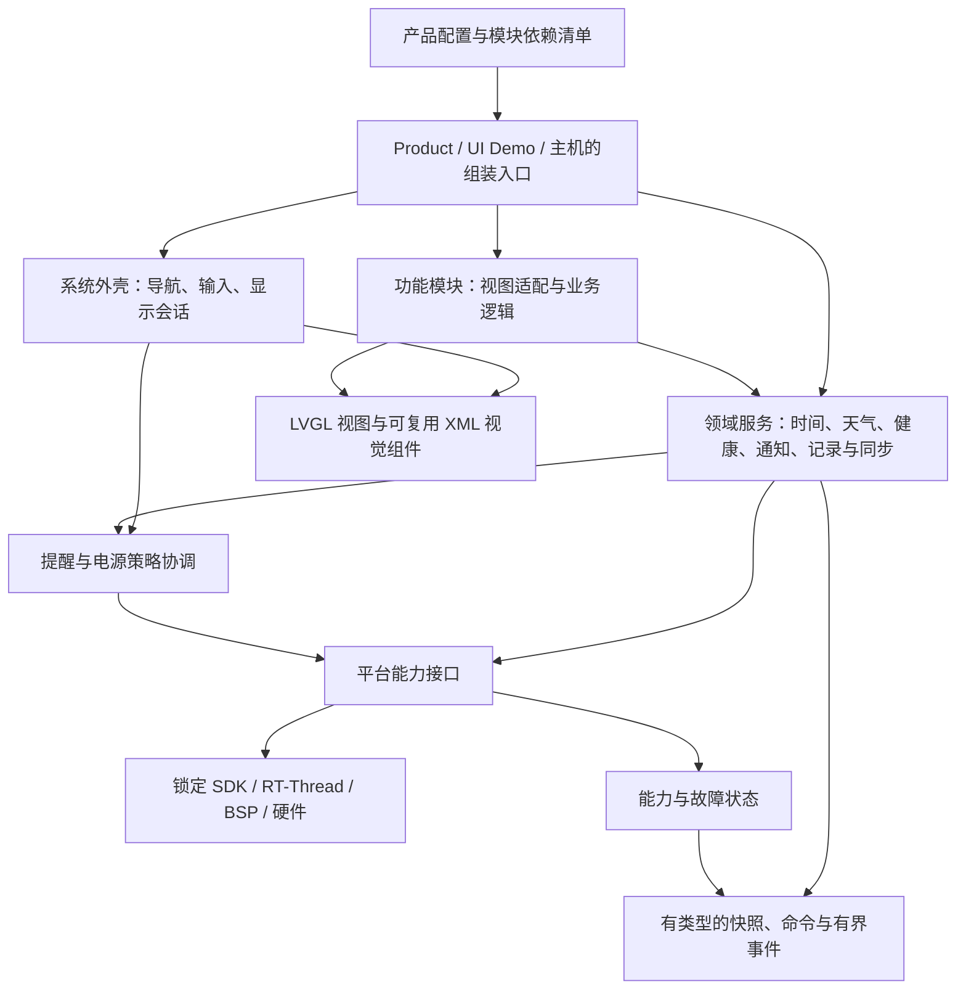
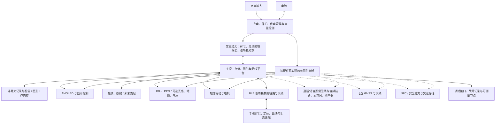

# WristFlow 目标架构指导

日期：2026-10-07。状态：**用户已确认的架构方向与后续实施约束**。本轮仅同步文档；下述机制、修复和验证路线尚未执行，不代表现有固件已经模块化或通过验收。

接续由 [任务索引](../PROJECT_INDEX.md) 进入 [STATUS 当前区](STATUS.md#current)，再按问题读取本页及 [架构审查处置与债务](ARCHITECTURE-REVIEW.md) 的相关契约。改变奠基性决定前完整读共识。本页负责目标与边界，审查页负责版本化事实、未决技术选择和阶段任务契约；唯一活动项与下一步由 STATUS 维护。

## 1. 目的、输入与适用范围

目标是逐步做出愿意日常佩戴、BLE 低功耗与 UI 交互同时成立的手表。Redmi Watch 4 的全部 33 个应用作为长期目标地图，用来提前发现架构缺口；当前按优先级实施。长期目标不等于已经证明现有芯片、协议、算法或外部生态能够支持全部功能。

本次产物包括现状对照、软件架构图、硬件功能框图、模块契约、UI 复用评估、故障降级方向及后续有界验证路线。具体 API、芯片型号、引脚分配、完整交互参数和逐应用实现仍留给相应阶段。

本次源码证据来自 `codex/weather-sync@0606f3b23bdaccae14f547f5fa55d997d3a50b21`；文档整理起点为 `origin/main@9ce5b3e32e338a279741464709f11b8bc3213931`。两者之间有四个未合入的天气提交；主线冻结固件实现仍按 `5c0b82c` 的历史记录识别。天气分支事实不能自动套到主线，详见审查页的版本表。

输入：

- [Redmi Watch 4 参考规格](REDMI-WATCH-4-SPEC.md)，本次补充权威边界说明前的原件 SHA-256 为 `11607f8f41e74c56ff5dfc4eed2effc3a4f5f45b187061647057861e6cc94dcd`。
- [已确认基线](BASELINE.md)、[原始共识](reference/手表原型方案_v0.2_共识.md)、[项目术语](../CONTEXT.md)。
- [当前状态](STATUS.md)、[构建记录](BUILD.md)、[硬件记录](HARDWARE.md)及本次源码只读核查。

参考规格中的真机观察、拟议体验、内部实现推测应分开理解。文档写有“实测”不等于本次重新验证过 Redmi 硬件，也不能从外部交互推断其内部线程、总线或电源实现。第 13 章的六条数据流、四种模板是待评估的设计提案；末尾“唯一真实事实来源”不能覆盖 WristFlow 的既有决定和源码事实。

原三个月日期、预算、首版范围、联合验收标准和 SDK 锁延续现有基线。2026-10-07 已确认在联合验收前增加版本核对与已确认风险修复；这只改变后续顺序，不授权本轮实施。本轮不安排采购、接线、构建或烧录。

## 2. 本次已确认的方向

| 决定 | 用户确认内容 | 对架构的约束 |
|---|---|---|
| Q1 长期范围 | 全部应用保留为最终目标，当前先做重要部分 | 全量评估依赖，不提前实现全部服务 |
| Q2 插拔形式 | 编译期可插拔、可裁剪 | 新配置重新构建固件；当前不设计运行时应用安装器 |
| Q3 框架完成线 | 用代表场景证明可扩展 | 同类扩展应局部；新类别允许演进公共契约 |
| Q4 模块入口 | 描述符与可选能力接口 | 元数据统一，视图、服务、路由、存储按需提供 |
| Q5 数据共享 | 分域提供者与有界事件 | UI 自己读取一致快照，业务服务不直接操作 LVGL |
| Q6 裁剪目的 | 证明解耦且不臃肿 | 要同时检查依赖、专属资源、后台活动和构建结果 |
| Q7 电源策略 | 系统统一协调生命周期和唤醒需求 | 使用现有 RTOS/SDK PM；应用不能自行决定整机深睡 |
| Q8 UI 复用 | 模板可复用也可退出，四类模板需重评 | 不强制 33 应用套四个完整页面 |
| Q9 硬件状态 | 声明能力，并检查真实硬件和运行故障 | 硬件错误应可定位，不能因单个可选部件异常拖死整机 |
| Q10 故障处理 | 分级降级、状态页可查 | 有界重试与手动检测；避免诊断本身造成持续唤醒 |
| Q11 提醒返回 | 高优先级提醒关闭后恢复有效的原会话 | 临时覆盖不等于退出；草稿、秒表和运动状态不能被自动清空 |
| Q12 定位硬件 | GNSS 为可选模块，保留未来带 GNSS 的可能 | 支持手机位置或独立定位的提供者边界，不预定器件 |

用户进一步澄清复用的目的：**已经存在且行为一致的功能，不应在每个应用里重写**。例如翻腕亮屏与持续亮屏选择的续航提醒，同为两个选项的确认流程，应评估复用整个共同交互，而不只是复用一个相似外观。该澄清约束下述 UI 评估。

第二次澄清明确要求**视觉与共同流程同时复用**：如果只差窗口文字，就使用同一视觉组件和同一交互实现，通过内容参数区分。修改公共布局、按钮、关闭或防重复点击缺陷时只维护一个实现；各入口仍需要回归检查，不承诺一次修改自动证明所有组合正确。

“系统统一协调”指产品的显示、后台任务、提醒和电源策略协调，不是另外编写一个 RTOS，也不意味着一个对象包办全部功能。

### 2.1 Claude 审查后的补充共识（2026-10-07）

| 决策 | 已确认边界 |
|---|---|
| R1 原则 | 采纳稳定身份、同步快照、Product 禁用 fixture、后台截止时间/唤醒服务、独立提醒仲裁、按槽位降级；具体实现不得照搬审查中的绝对断言 |
| R2 当前风险 | 记录为架构债务与下一步核查项，本轮不改代码或做实验；相关能力不再宣称全部完成 |
| R3 记录位置 | 正式架构指导进入 docs，并同步 BASELINE、STATUS 和 CONTEXT |
| R4 组件独立 | 组件可独立于完整应用视图存在；详情入口可选，共享提供者按依赖保留 |
| R5 裁剪呈现 | 新菜单/设置隐藏未编入功能；旧布局只将受影响槽位标为不可用，保留原标识及其他配置；已编入但硬件缺失/故障保留说明入口 |
| R6 确认被打断 | 暂停并保留请求；提醒结束且原会话有效才恢复，否则取消；确认时重查条件，不自动同意、不重置原熄屏计时 |
| R7 后续顺序 | 版本/证据核对 → 数据真实性、同步和配置安全 → 同版联合验收与功耗测量 → 公共确认 → 天气裁剪 → 倒计时唤醒；当前仅记录 |

R6 保留普通页长睡 120 秒回表盘、编辑草稿与前台秒表的既有豁免。参考规格中的“息屏立即清栈”和“提醒结束必回表盘”不覆盖此决定。

## 3. 当前工程已经具备什么

以下路径和行号对应上述 HEAD；都是源码检查证据，不代表新构建或硬件验收。

| 已有接缝 | 源码证据 | 仍需解决的边界 |
|---|---|---|
| 应用注册表 | `ui/runtime/app_registry.h:19`，`app_registry.c:30` | 已统一菜单、组件入口、工厂与摘要读取；能力是静态枚举，尚无完整后台服务契约 |
| 独立导航模型 | `core/watch_core.h:18`、`:59`，`watch_core.c:75` | 固定 surface 枚举和最大深度 8；新增页面还会触及中央定义与路由规则 |
| 视图创建与回收 | `ui/runtime/apps.c:476`、`:662` | 按页面惰性创建、离栈释放；应用绑定和特殊行为仍集中在 apps.c |
| 生命周期与退出确认 | `ui/runtime/ui_shell.c:290`、`:331` | shell 直接识别秒表、编辑器、天气等；未来应由局部契约表达例外 |
| 表盘独立回调 | `ui/runtime/watchface.h:7` | 创建、更新、可见性、销毁已有边界；可借鉴其所有权，不直接照搬为所有应用的万能接口 |
| 分域数据与平台组装 | `core/weather.h`、`core/notifications.h`、`apps/product/src/main.c:28` | 通知、天气和基础快照已分开；天气刷新还由 main.c 检查活动页面名称后直接调用 |
| BLE 与事件传递 | `apps/product/src/product_ble.c:162`、`:219`，`product_pm.c:57` | BLE 用 32 项队列；产品唤醒用事件位。后者可合并相同事件，不能直接充当可靠逐条业务队列 |
| 设置异步保存 | `apps/product/src/product_services.c:53`，`core/component_layout.h:6` | UI 与 Flash 写入已有边界、布局双记录；后台每 100ms 检查，未来需评估其空闲唤醒成本 |
| 息屏与 PM | `apps/product/src/main.c:61`，`product_pm.c:47` | 息屏等待事件、恢复首帧后提亮；PM gate 尚不表达所有未来服务的资源需求 |
| XML 视觉组件 | `ui/xml/components/card_container.xml`、`metric_full.xml` | 已复用 tile 和参数；不自动提供业务模型、服务或故障恢复 |
| 已有确认弹窗复用 | `ui/xml/components/component_confirm.xml`，`ui/runtime/settings_view.c:42`、`:58` | 60 秒熄屏与持续亮屏已有共同确认入口；业务通过数值分支区分，其他确认流程仍各自绑定回调 |
| XML/运行时并存 | `ui/runtime/weather_screen.c:322`、`:405`，`docs/WEATHER-UI.md:9` | 天气四页由手写 C 构建，日升日落调用生成页面；不能将现有五份 XML 当作完整运行时视觉来源 |
| 资源构建 | `ui/xml/SConscript:3`，`ui/xml/wristflow_ui_gen.c:123` | 按目录收集且集中初始化资源；尚无完整功能依赖裁剪。实际链接保留量需以后检查 map |
| 启动与错误处理 | `apps/product/src/main.c:131`、`:144`、`:163` | 多处硬件路径直接断言；部分存储失败已可回退，但不存在统一故障降级模型 |

因此，下一步有价值的架构工作是在这些接缝上减少中央分支和隐含依赖。源码中出现了描述符、队列或回调，不足以宣布通用插件框架已经完成。

## 4. 软件目标结构

图中是职责和依赖方向，**不是线程数量，也不是本轮要新建的目录清单**。

建议区分五个对象：

1. **应用**：用户可进入的一项完整功能，可包含多页和对服务的调用。
2. **页面/视图**：当前呈现和交互状态；销毁页面不必终止后台业务。
3. **组件**：某项信息或功能的摘要，可独立存在，详情入口可选；多个实例共享数据源而不重复启动采样。
4. **后台活动**：用户已启动、可跨页面持续的业务，如倒计时或运动记录；有可查询状态和终止条件。
5. **平台能力**：显示、输入、位置、传感器、存储、音频等受约束的接口；能力存在不等于当前可用或测量有效。

UI 线程独占 LVGL。后台服务拥有其数据，公开快照复制或有明确定义的读取生命周期；“不可变快照”不能掩盖跨线程读写竞态。页面关闭后，迟到事件不能继续访问已释放控件。

### 4.1 模块契约与依赖

稳定身份用于持久配置、路由和能力引用；不能用中央枚举的顺序判断“应用/编辑器”等类别，新增模块不应迫使无关核心修改范围判断。字符串、显式稳定整数或构建生成的映射均可候选，格式与迁移方案待首个实现任务确定。领域/构建元数据不依赖 LVGL；UI 层描述符可持有 LVGL 工厂和回调，不要求把所有描述符做成无行为纯数据。

模块清单覆盖源码、官方生成 UI、资源、服务、协议处理、设置贡献与能力依赖。功能编入、运行时硬件健康、业务数据有效性是三个维度，不能压进一个 ready/placeholder/unavailable 枚举。声明依赖属于元数据；当前错误、重试与测量值属于拥有者的运行状态。

描述符声明稳定身份、入口、可选路由和能力要求。构建清单声明源码、官方生成 UI、专属资源、共享资源及服务依赖；具体用 SCons/Kconfig 哪种表达在第一个实验中选最小可行方式，不提前建立通用包管理工具。

各可选接口至少说清：调用上下文、所有权、启动/取消/结束条件、失败返回、恢复策略与资源预算。简单信息页不必拥有后台服务；服务也不必拥有应用菜单入口。路由身份与持久化身份不应依赖易变的枚举序号。

裁剪以依赖闭包为准：关闭心率应用但保留睡眠时，PPG 服务仍可能必需；关闭天气应用但保留天气组件时，天气缓存和手机解析也仍必需。只有没有剩余消费者的专属部分才应被移除。共享字库保留不等于裁剪失败。

缺少必需依赖应在构建时明确报错，或由产品配置明确选择降级；不能让它变成链接期偶然失败。运行配置关闭功能与不编入固件是两种状态，不能用隐藏菜单证明二进制裁剪。

保存的组件配置可能引用已裁掉的模块：逐槽安全解析，保留原标识、尺寸和配色，受影响槽位显示不可用且不能跳入不存在页面；不得因为一个缺失引用重置整页或整份布局。记录损坏与版本不兼容另走已有校验/迁移规则。新菜单、设置与选择器隐藏未编入项；已编入但硬件缺失/故障的入口说明原因。新配置的默认布局只引用其编入组件，可以由产品配置显式声明，不强制自动推导；重新加入模块后的恢复在裁剪任务中验证。

### 4.2 数据、事件与通信

Product 构建不得包含用于伪造业务数据的 fixture、mock provider 或 mock 注入命令；演示/测试数据只由独立 UI Demo、主机测试或显式诊断构建提供。无手机数据、未校时、未测得或已过期必须真实表达；不能把当前温度充当最高/最低温，也不能补上虚构的日出、预报或健康值。移除 fixture 本身不证明真实手机数据已打通，两者分别验收。

跨线程写入、重置与读取使用同一拥有者定义的同步契约，UI 不能直接读取后台正在修改的全局结构。快照带版本、来源、时间与有效性；具体互斥复制、消息移交或双缓冲方案按数据量选择。版本检测与复制必须避免竞态，不因“不可变”命名或只加 volatile 就视为线程安全。

“时间、环境、通知、健康、设备、配置”可用于划分数据职责，但不是六条彼此独立的物理总线。时间戳跨多个领域，勿扰影响通知，离腕判断关联传感器与电源，BLE 同时承载多种数据。

建议分别表达：

- **状态**：最新天气、设备状态等可按版本合并；快照带有效性、时间、来源和过期信息。
- **命令**：开始测量、保存设置、请求同步；需要成功、失败、超时或取消结果。
- **离散事件**：闹钟到期、硬件故障、通知变化；声明容量、优先级、合并/丢弃规则与溢出计数。重要到期事件要能从权威任务状态重新发现，不能静默丢失。
- **连续数据**：PPG 原始样本、音频等使用专用缓冲/FIFO，不把每个样本广播给所有 UI。

手机协议适配不应承担业务存储、页面布局或所有算法。现有 Gadgetbridge 通知/天气接入不证明未来健康历史、联系人、日程、支付或语音服务可用；每项仍需核对协议与手机端载体。

时间同时区分日历时间、数据收到/观测时间和持续时长：校时/时区变化影响显示和日程，不应让已运行的秒表突然跳变。持续时长活动以单调时间/截止时间为权威，日历闹钟按日历规则重算计划；后台到期通过系统唤醒服务送达，不依赖 LVGL 定时器回调持续运行。睡眠计时连续性、RTC/LPTIM 可用性和误差以后在目标板验证；禁用 LVGL 回调不等于系统 tick 停止。

### 4.3 会话、提醒与电源

视图可见性、用户会话、后台业务和硬件活动分别记录。倒计时运行不等于其页面常驻，更不等于阻止整机休眠。手电筒的持续亮屏需求也不能套到全部“沉浸式页面”。

电源申请须带申请者、原因和期限；完成、取消、超时、故障退出均有清理路径。期限到达时先安全终止工作并释放硬件资源，不能只删除电源锁而让设备继续工作。共享传感器由服务协调使用者，不能因一个页面退出就切断另一个业务的采样。

高优先级提醒由独立仲裁点和覆盖层宿主管理，职责独立于导航栈；不在 shell 中不断增加应用特例。关闭后根据同一会话策略恢复有效的原会话；普通页超过原始 120 秒长睡规则则回表盘，编辑草稿/前台秒表保留豁免。待答确认请求暂停保留，原会话有效才恢复，失效则取消，重新确认时检查能力；提醒不重置原熄屏时刻。已确认的草稿放弃、秒表退出确认和勿扰规则继续有效。多个提醒同到、来电与闹钟冲突等细则在实际接入时细化；框架应有仲裁点，不让各应用直接争抢屏幕和振动。

定时唤醒、临时亮屏保持与硬件操作期间的有界休眠约束应分别表达；不强制只有两种申请，也不为每个外设预造通用资源管理器。

保留“息屏”和“系统深睡”的区别。AOD 是未来独立显示模式，必须拥有自己的刷新、像素、驻留和功耗预算；不预设 52 系列 LCPU 能运行自定义算法。

## 5. UI 复用评估：组件与行为分别组合

四类完整应用模板不足以覆盖长期目标：

| 反例 | 暴露的问题 | 建议复用内容 |
|---|---|---|
| 秒表与倒计时 | 相似数字界面，一个退出清零，一个后台到期 | 数字/按钮布局；计时模型与生命周期分开 |
| 手电筒与来电 | 白屏工具和通信抢占不能共用黑底计时任务模型 | 输入过滤、操作按钮、提醒容器等局部能力 |
| 心率、血氧、呼吸训练 | 连续监测、单次测量与节奏引导不是同一种采样状态机 | 数值、圆环、阶段提示；任务模型按需组合 |
| 天气与运动记录 | 可共享曲线/指标块，但来源、过期、历史查询和滚动行为不同 | 摘要、趋势图、指标格与滚动容器 |
| 日历、拨号盘、地图、支付码 | 四类模板不能自然表达 | 网格、键盘、专用画布或独立页面，保留统一导航与能力边界 |

建议分三层逐步积累：

1. **视觉资源与部件**：颜色、间距、圆角、字体、图标、标题、列表行、按钮、卡片、状态提示、曲线/时间轴。
2. **交互容器**：纵向滚动、横向分页、选择器、左滑操作、边缘返回、模态覆盖。每项明确手势冲突和可取消规则。
3. **应用组合示例**：用真实天气、计时、测量等场景组合前两层；出现稳定重复后再提取更高层模板。

不以“模板越多/越少”评价完成度。为每个候选应用记录：视觉块 × 交互容器 × 数据来源 × 会话/后台行为 × 电源需求 × 故障路径 × 构建依赖，防止同一种外观暗含一套不合适的生命周期。

XML 继续承担视觉结构、样式和资源，官方 Pro 导出 C；运行时适配负责数据绑定、行为和动态列表。相同结构应复用模板实例，避免同时维护两份完整布局。天气现有双重定义作为未来验证样本，不能借本次规划偷偷重写。

生成物与 XML 一致性、动态中文字形、资源体积、控件命名契约、实际渲染和硬件手势都要分别检查。GUI 导出与 LVGL 9.4.0 路线沿用既有决定；不建立自制 XML 导出器。

### 5.1 具体复用样本：两选项确认弹窗

用户提出的“翻腕亮屏/持续亮屏会减少续航”的提示，是比整页应用模板更明确的复用单元：展示说明，等待确认或取消，关闭弹窗，再由调用功能执行其操作。

当前源码已经部分做到：`settings_view.c` 的 `confirm()` 为 60 秒熄屏与持续亮屏创建同一 `component_confirm`，填入不同文案并绑定确认/取消；`accept_settings_confirmation()` 通过 `value >= 1000` 区分持续亮屏和熄屏偏好。`ui_shell.c` 的秒表退出确认、`components.c` 的组件确认也使用同一 XML 工厂。因此外观已经共享，但通用弹窗流程与各功能业务仍有可进一步拆分的部分。本 HEAD 的翻腕设置仍是未开放入口，不能把它记为已有第二个实机实现。

| 共同部分：只实现一次 | 调用方差异：由各功能提供 |
|---|---|
| XML 弹窗外观、说明区、两个选项的排布 | 提示文案、选项文字/图标及必要的显示参数 |
| 打开、关闭、阻止输入穿透、清理回调 | 本次请求所属的页面/会话与业务上下文 |
| 确认/取消结果只交付一次，防重复点击 | 确认后启用翻腕，或从确认时开始持续亮屏五分钟 |
| 所属页面退出后取消未完成请求，不调用失效对象 | 原有设置值、可用能力与具体保存/执行方法 |
| 接收系统输入策略规定的关闭/回主页动作 | 真正不同的退出语义通过明确选项表达，不能偷偷改变已有规则 |

建议的轻量契约是“显示一项确认请求，返回确认/取消结果”，而不是让通用弹窗认识全部设置项或不断增加功能 ID 分支。具体函数签名在实现时确定；当前不需要通用工作流引擎、脚本解释器或为弹窗建立新线程。

对于用户描述的**仅文字不同**的提示，布局、样式、按钮外观及共同事件处理全部使用同一来源，只替换说明文字；不复制两份 XML，也不在各页面复制一份弹窗控制代码。确认后的业务操作以调用方提供的结果处理连接。共同 bug 修一次覆盖所有调用方；如果问题属于某个业务操作，只修对应业务。物理上可以按需创建多个实例，“实现只有一份”不要求全系统永远只存在一个控件对象。

确认意味着用户同意执行，不等于硬件动作/保存已经成功。调用方随后处理失败与状态刷新；若弹窗等待期间硬件失效，确认后仍需重新检查能力。取消不得改变原状态，重复点击不得重复启动任务，自动提醒覆盖也不得冒充一次确认。

最先可以用现有的“60 秒熄屏”和“持续亮屏五分钟”验证此契约，再将未来翻腕提示接入。若新增同类提示只提供文案、上下文和结果处理，公共弹窗实现无需新增业务分支，就得到了一条实际的复用证据。删除、放弃草稿、秒表退出可继续评估是否属于同族；异步进度、验证码输入、带复杂列表的弹窗不因都有两个按钮就强行合并。

## 6. 全部 33 个应用的架构覆盖地图

此表全量保留最终目标，不给所有功能承诺时间或当前硬件支持。近期落地顺序仍由现有基线决定。

| 应用 | 可复用视觉/交互 | 主要服务或平台依赖 | 架构上必须分清 |
|---|---|---|---|
| 01 运动 | 指标面板、操作控制、锁定输入 | 运动会话、IMU、可选 PPG/定位、记录 | 页面退出与记录结束 |
| 02 运动记录 | 列表、详情、曲线、轨迹画布 | 历史查询、时间、位置记录 | 大历史分页与内存上限 |
| 03 跑步课程 | 课程列表、分段提示 | 训练会话、定时、触觉/可选音频 | 引导步骤与长期记录 |
| 04 训练状态 | 摘要、趋势图 | 训练历史与算法结果 | 算法不可用与测量无效 |
| 05 活力指标 | 进度图、指标卡 | 步数、活动聚合、日历时间 | 跨天与时区变化 |
| 06 心率 | 测量面板、曲线 | 共享 PPG、采样任务、结果库 | 前台测量与周期采样 |
| 07 元气值 | 分数、趋势 | 多源健康数据与算法 | 缺少输入时不能编造评分 |
| 08 血氧 | 测量状态、数值 | 支持相应光路的 PPG 与算法 | 单次任务、质量与超时 |
| 09 睡眠 | 阶段时间轴、摘要 | PPG/IMU、夜间记录、手机算法与同步 | 稀疏数据不自动支持分期 |
| 10 压力 | 仪表、曲线 | 满足质量要求的信号、HRV/算法 | 数据质量与算法适用性 |
| 11 呼吸训练 | 节奏动画、控制 | 引导计时与触觉，可选测量 | 动画节奏不等于传感器采样 |
| 12 米家 | 设备列表、开关卡 | 手机/生态适配与授权 | UI 就绪不等于生态可用 |
| 13 小爱同学/语音能力 | 录音状态、结果页 | 麦克风、音频流、手机/服务适配 | 语音能力与指定品牌服务可接入性 |
| 14 天气 | 摘要、预测列表、指标与曲线 | 手机天气、缓存、过期策略 | 应用、组件、表盘共享一份数据 |
| 15 卡包 | 卡片选择 | NFC、相应安全能力与发行链路 | 普通卡片 UI 与真实凭证能力 |
| 16 日历 | 月历网格 | RTC、时区/历法 | 日历时间不是运行时长 |
| 17 日程 | 列表、详情、提醒 | 手机同步、记录、计划调度 | 同步变更与本地到期 |
| 18 待办 | 勾选列表 | 任务记录、同步、提醒 | 幂等更新与冲突策略 |
| 19 常用联系人 | 列表、详情 | 联系人同步、可选呼叫命令 | 个人数据和日志边界 |
| 20 电话 | 拨号盘、通话覆盖层 | 通话控制、音频链路、扬声器/麦克风 | 通话音频不等于 BLE 通知管道 |
| 21 音乐控制 | 封面、控制按钮 | 手机媒体状态与控制适配 | 遥控播放不等于本地音频播放 |
| 22 遥控拍照 | 快门、倒数提示 | 手机相机/HID 或伴侣能力 | 传输已连接不等于手机接受快门 |
| 23 闹钟 | 列表、时间选择、提醒 | 日历调度、RTC、触觉 | 重复规则、校时、重启恢复 |
| 24 番茄钟 | 阶段计时、控制 | 阶段任务、到期提醒 | 与倒计时共享机制，保留业务状态 |
| 25 秒表 | 大数字、控制 | 持续时长基准 | 前台息屏保留与主动退出清零 |
| 26 倒计时 | 时间选择、控制、提醒 | 后台截止时间、低功耗唤醒 | 视图销毁后仍可到期 |
| 27 世界时钟 | 城市列表、时间 | UTC、时区规则 | 不能硬编码全部为 UTC+8 |
| 28 指南针 | 专用刻度画布 | 地磁、校准；可选位置/气压 | 磁方位、经纬度和气压是不同能力 |
| 29 找手机 | 操作状态、停止 | 手机命令、超时与应答 | 发送命令与手机实际响应 |
| 30 手电筒 | 白屏、输入控制 | 显示临时亮度申请 | 退出恢复偏好，不改永久亮度 |
| 31 支付宝 | 专用码图、状态 | 相应授权、凭证、安全存储与时间 | 长期目标不等于已有接入权限 |
| 32 微信支付 | 专用码图、状态 | 相应授权、凭证、安全存储与时间 | 不从显示二维码推断支付可用 |
| 33 设置 | 分组列表、选择器 | 配置、能力、诊断、系统操作 | 偏好值、临时状态与实际能力 |

表盘、组件环、通知中心、控制中心、故障状态页和全局提醒是这些应用共用的系统设施，不能因为不在 33 项清单里而漏掉。升级/恢复、恢复出厂和数据迁移属于后期系统能力，要在存储、身份和构建边界中保留演进空间，不在当前预建完整实现。

## 7. 最终硬件功能框图

这是功能与供电职责规划，不是 Redmi 内部电路的逆向结论，也不是新的 BOM。实线表示期望的主路径；虚线表示长期可选/需核验的扩展。是否集成于同一芯片、能否独立断电、总线和电压均待选型与测量。

当前黄山派只是验证平台，资料配置为 SF32LB525UC6、8MB PSRAM、16MB NOR，实物容量和峰值预算仍需验证。未来增加通话、GNSS、NFC 等可能需要更换平台或增加器件；接口抽象可以约束影响范围，不能保证硬件变化绝不触及上层体验。

硬件选型重点是唤醒源、共享供电/总线、传感器 FIFO、可停止的负载、天线布置、音频路径以及故障可定位性。当前板级关屏路径涉及音频/充电/传感器等共享行为，应先实测，不能把逻辑模块独立误当成物理电源隔离。

“BLE 通话”“BLE AVRCP”等参考文字不能直接作为协议契约。普通 BLE 数据管道不能替代通话音频系统；传统 HFP/AVRCP 与具体手机媒体控制通道应分别核验。是否支持特定协议和生态以候选平台与手机端证据为准。

## 8. 硬件检查、故障与恢复

区分编译未包含、硬件不存在、尚未检测、可用、故障、恢复中，以及业务数据的有效/无效/过期状态。开机读到器件 ID 不等于传感器准确、触摸灵敏或电池可安全充电。

| 失效情况 | 目标行为 |
|---|---|
| PPG/地磁等可选部件缺失或超时 | 终止相关任务、释放资源，标记受影响功能；其他独立功能继续 |
| BLE 断连或协议失败 | 本地时间/计时/记录继续，手机数据标记过期，按策略重连 |
| 配置/记录存储失败 | 说明未保存、避免写入死循环；能用默认值或只读模式的部分继续 |
| 触摸异常但显示与按键可用 | 提供可行的简化操作/诊断入口，不承诺按键能够替代全部触摸交互 |
| 显示、主控或关键供电异常 | 尽力通过可用通道记录原因和受控停止；不承诺仍能显示诊断页 |
| 总线被故障器件占住 | 有界超时、总线恢复或隔离；共享总线上的其他器件可能一并受影响 |

设备状态页展示部件/能力、最近成功与失败时间、错误码/简要原因、受影响功能、重试次数和恢复结果。原因未知时记录“响应超时”等观测，不把它伪装成已查明的根因。严重供电类错误需要及时提示或保护动作；可选传感器错误通常由状态页与使用入口解释。

恢复通过现有操作错误、低频必要检查和手动重试触发；有上限、退避和取消路径。传感器单次任务沿用既有超时及最多一次重试约束，长期恢复与一次测量重试分开定义。故障风暴不能造成持续振动、无界日志、反复启动或常驻高频探测。

日志采用有界缓冲与计数，避免逐采样写 Flash，也避免记录通知正文、联系人或支付凭证。系统级看门狗属于最后恢复手段，不能掩盖任务取消、驱动超时和故障定位缺失。

## 9. 怎样证明解耦、轻量与可扩展

以下是**后续验收场景，本轮全部未执行**。执行次序见第 10 节；场景编号不代表先于数据/配置安全问题。每项只验证一条闭环，记录改动范围、构建纳入项、资源增量及失败路径。

| 实验 | 最小场景 | 需要证明 |
|---|---|---|
| E0 共同确认流程 | 现有 60 秒熄屏与持续亮屏五分钟提示，未来再接翻腕提示 | XML 与共同交互只实现一次；确认/取消/离开清理一致，业务操作各自拥有；无功能 ID 堆叠 |
| E1 同类视图扩展 | 一个新信息页与卡片复用已有数据和视觉部件 | 不修改通用导航/电源业务分支；只改模块及必要组装声明 |
| E2 依赖裁剪 | 天气全关闭；关闭天气应用但保留天气组件；关闭心率 UI 但保留睡眠依赖 | 专属代码/资源/任务移除，共享依赖正确保留；旧配置不崩溃 |
| E3 后台任务与覆盖 | 倒计时退出页面后熄屏，到期打断编辑/秒表 | 任务继续、到期可达、关闭提醒恢复会话；无忙轮询或泄漏的唤醒申请 |
| E4 故障注入 | 设备缺失、测量超时、掉线、存储失败与恢复 | 有界退出、可解释状态，其余能力继续；同一故障不形成重试风暴 |
| E5 并发资源 | 通知突发、BLE 重连、采样与 UI 操作重叠 | 队列有界、过期数据可识别、无跨线程控件访问，输入与绘制可测 |
| E6 XML 实际复用 | 用官方导出组件完成两个确实相似的页面 | 不维持重复布局；名称/字体/资源/动态状态与真实渲染相符 |

建议保留最小产品、日常产品和带代表性扩展的配置进行比较，具体配置文件形式以后决定。记录链接 map 中的专属符号、Flash/RAM、对象与线程栈峰值、队列上限、活动定时器和唤醒来源。只看总 BIN 变小不足以证明解耦；只看菜单隐藏也不足以证明裁剪。

“不臃肿”的结束条件是：没有为了未实现功能常驻的空服务；新增模块有明确资源增量；删除模块不需要散改无关功能；公共抽象由至少两个实际用例或不可绕过的系统约束支持。拒绝以文件夹数量、接口数量或描述符数量充当完成指标。

UI 检查手势取消、连续快速操作、返回位置、首帧唤醒和帧间隔分布；平均 60fps 不能独立证明体验。性能数字在目标硬件测量后再定，不把参考规格的 60Hz 当作已验证保证。

续航继续沿用现有比较负载：每日 45 分钟亮屏、30 次通知、日常 BLE 逻辑连接、AOD 关闭、日间心率默认每 10 分钟尝试，夜间策略单独记录。300mAh/20% 余量仅是比较基准，对应七天约 1.43mA 平均电流；跨电压用能量。AOD、通话、GNSS 的使用模式另记增量，不能要求所有功能常开仍自动继承七天目标。

## 10. 后续实施顺序与停止边界

以下为 2026-10-07 确认的阶段依赖与停止边界，保留当时尚未执行的语境，不维护当前执行状态；进展和当前获准范围只见 [STATUS 当前区](STATUS.md#current)。具体交付契约见 [审查债务表与任务卡](ARCHITECTURE-REVIEW.md)。

2026-10-08 用户已调整推进顺序，见 [BASELINE 补充](BASELINE.md#2026-10-08-清理完成线与恢复开发)：先保全/收拢及分别修复天气、C2，保留同版联合验收；功耗成为独立里程碑。清理后复杂任务选倒计时，所需共同确认和提醒随用例实施，完整天气裁剪不再作为倒计时前置。下列 N0–N5 编号及技术验收契约保留，旧排序不作为新任务授权；没有因此关闭任何代码债务。

1. **N0 版本与证据核对**：区分主线、天气分支和 C2 草稿，核对源码、构建证据与设备版本，明确后续修复与联合验收采用的提交；不把本次文档合并当作天气代码合并。
2. **N1 数据与配置安全**：在选定版本逐项处理 Product 假数据、天气快照同步/时效与缺失引用局部降级；复核 BLE 多生产者序号/入队顺序，按确认结果修复。拆分可独立审查与验证的提交，不先改造全部应用身份。
3. **N2 同版联合验收与受控功耗测量**：沿用 [验收矩阵](PRODUCT-ACCEPTANCE.md) 的标准；如果代码已修复，旧冻结固件不再替代新版本验收。软件 PM 计数不证明真实深睡电流或续航；实物/仪器条件不足时记录阻断。
4. **N3 公共确认（E0）**：同一 XML 外观与共同控制器，先接现有两种设置提示，覆盖确认、取消、页面离开、重复输入、提醒中断/恢复和失效请求；不为此开新线程。
5. **N4 天气裁剪（E2）**：完整、仅卡片/服务、全关闭三种配置；证明专属源码、资源、协议处理、请求和后台活动按依赖裁掉，共享字体可保留。旧布局只在天气槽位降级。第一次建立边界可触及现有耦合文件；建立后切换配置应只改配置/必要组装声明。
6. **N5 倒计时唤醒（E3）**：验证离页/熄屏后截止时间仍有效，到期可重建且只交付一次提醒，关闭后恢复有效会话；同时验证原待答确认请求和长睡策略。硬件精度指标在确定计时与唤醒源后设定。
7. 此后按进入实施的功能逐项验证共享 PPG/故障隔离、历史记录与手机同步、语音/音频、GNSS、NFC/支付。C2 继续独立复核体验与集成，不因本架构文档被视为通过；PPG、新接线仍受已有闸门约束。

如新框架必须先重写大量可用页面才能验证一个模块，或最小配置仍携带无用任务/资源，应缩小抽象并检查依赖。允许先采用显式模块列表和局部条件编译，但不能据此宣称完整裁剪已通过。

以下差异与技术选择明确延期，进入对应实现前再对齐：

- 参考规格最多 7 个组件页，当前上限 6 页；当前不修改。
- 天气参考编排与现有五页结构不同；不在本次架构记录中决定重做页面。
- 当前秒表只在前台（含息屏）保留，主动退出确认后清零；倒计时才要求离页后继续。
- 字库共享还是按功能子集化、控件绑定方式、模块清单格式、稳定 ID 编码、设置条目贡献机制，待 map、官方导出能力和代表用例支持后选择。
- 关闭心率页面时是否保留高/低心率告警属于尚未确认的功能开关语义；架构允许服务独立，不能默认裁页即停止告警。
- AOD、表冠手感、复杂多提醒优先级、OTA/恢复等未冻结完整行为；本参考不重新开放当前明确不做的设备密码和自动运动识别。
- 不承诺更换硬件绝不影响上层；不采用“AMOLED 背光”“彻底避免烧屏”等不严谨工程保证。

## 11. 本轮交接与证据边界

已完成参考规格、既有共识与源码静态审查，以及用户逐项决策对齐。两张 Mermaid 图与 33 应用矩阵描述目标，所有 N/E 任务仍未执行。Claude 原审查未核对 Git HEAD；本次主代理复核及独立只读复核绑定天气分支 `0606f3b`，采纳范围与限定见审查页。

本轮仅做文档 UTF-8、相对链接、差异/空白和内容一致性检查；不新增主机测试、固件编译、XML 导出、上板、功耗或续航证据。图做文本结构审查，未渲染验图。既有编译/烧录/用户视觉反馈保留为各自版本的历史证据，不因本次审查被抹除，也不扩大为新版本验收。

后续 agent 不需要重做已确认的需求访谈；只对未决技术/行为选择补证据与提问。文档变更的 PR 合并状态在 PR 或交接中回读；活动任务从 [STATUS 当前区](STATUS.md#current) 取得，不自动运行历史任务。
