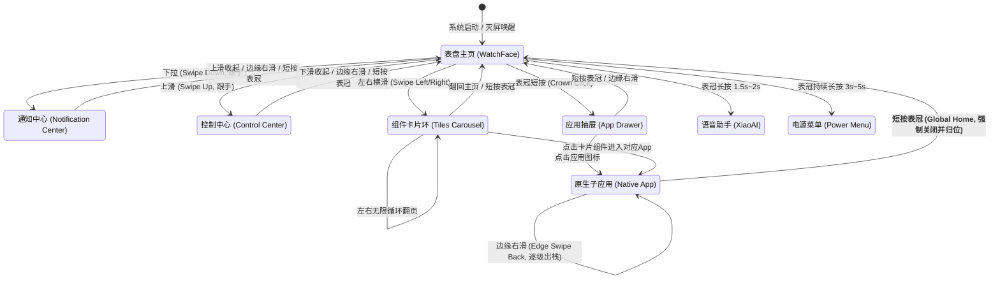
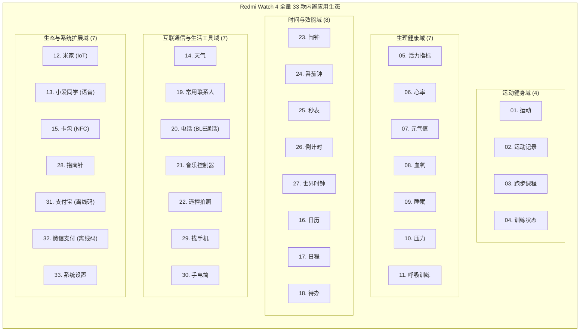
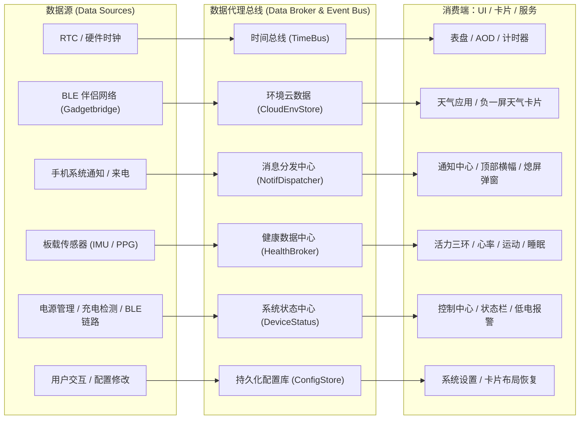

# Redmi Watch 4 目标规格与逆向复刻全书 (Target Specification)

> **WristFlow 使用边界（2026-10-07）**：以下保留用户与其他 AI 整理的参考原文，混合了真机观察、目标体验与内部实现假设，不构成 Redmi 内部架构的已验证证据。WristFlow 的已确认方向以 [BASELINE](BASELINE.md) 和 [目标架构指导](ARCHITECTURE.md) 为准，当前完成度以 [STATUS](STATUS.md) 为准。四类模板、六条“正交”数据流及文末“唯一真实事实来源”是原稿观点，不具有覆盖既有决定的权威。33 项作为长期目标分级推进，本阶段不据此实施全仓重构。

> **版本**：v0.1-Draft
>
> **定位**：Redmi Watch 4 (HyperOS for Watch) 完整交互与系统架构复刻基准规格
>
> **目标**：事无巨细沉淀 Redmi Watch 4 的每一个物理细节、交互动效、数据拓扑与软件架构，作为评估与重构 WristFlow 模块化框架的终极对标文档。

---

## 目录 (Table of Contents)

1. [物理交互与硬件触感矩阵 (Physical Interaction & Haptic Matrix)](#1-物理交互与硬件触感矩阵-physical-interaction--haptic-matrix)
2. [顶层拓扑与手势导航状态机 (Top-level Topology & Navigation)](#2-顶层拓扑与手势导航状态机-top-level-topology--navigation)
3. [表盘与 AOD 常亮显示引擎 (Watchface & AOD Subsystem)](#3-表盘与-aod-常亮显示引擎-watchface--aod-subsystem)
4. [负一屏与小部件快照环 (Widgets / Tiles Carousel)](#4-负一屏与小部件快照环-widgets--tiles-carousel)
5. [通知系统与全局弹窗 (Notification & Toast/Modal Architecture)](#5-通知系统与全局弹窗-notification--toastmodal-architecture)
6. [控制中心与系统快捷开关 (Control Center & Quick Settings)](#6-控制中心与系统快捷开关-control-center--quick-settings)
7. [应用抽屉与应用生命周期 (App Drawer & Lifecycle Management)](#7-应用抽屉与应用生命周期-app-drawer--lifecycle-management)
8. [健康、传感器与后台采样管线 (Sensors & Health Pipeline)](#8-健康传感器与后台采样管线-sensors--health-pipeline)
9. [通信、手机同步与伴侣协议 (BLE & Companion App Protocol)](#9-通信手机同步与伴侣协议-ble--companion-app-protocol)
10. [系统设置全层级规范 (System Settings Full Hierarchy)](#10-系统设置全层级规范-system-settings-full-hierarchy)
11. [全量 33 款内置应用档案与分类矩阵 (Complete 33 Native Apps Matrix)](#11-全量-33-款内置应用档案与分类矩阵-complete-33-native-apps-matrix)
12. [后台服务、常驻指示器与高优先级抢占式弹窗 (Background Services & Alerts)](#12-后台服务常驻指示器与高优先级抢占式弹窗-background-services--alerts)
13. [系统级数据流全景与跨应用通用复用框架 (Data Streams & UI Paradigms)](#13-系统级数据流全景与跨应用通用复用框架-data-streams--ui-paradigms)
14. [电源管理、充电交互与离腕安全模型 (Power, Charging & Security)](#14-电源管理充电交互与离腕安全模型-power-charging--security)
15. [复刻基准总结与后续架构评估指引 (Summary & Architecture Assessment Guide)](#15-复刻基准总结与后续架构评估指引-summary--architecture-assessment-guide)

---

## 1. 物理交互与硬件触感矩阵 (Physical Interaction & Haptic Matrix)

### 1.1 旋转表冠 (Digital Crown) 物理契约
- **短按 (Single Click / Key Click)**:
  - **在表盘主界面**：直接呼出应用抽屉（App Drawer，可配置为网格视图或垂直列表视图）。
  - **在非表盘界面（应用、设置、二级详情、负一屏等）**：**一律作为 Global Home 键，直接关闭当前应用并瞬时返回表盘主界面**（不逐级出栈；逐级返回由边缘右滑手势承担）。
- **双击 (Double Click)**:
  - 默认无特殊行为（No-op，避免误触）。
- **长按阶梯模型 (Tiered Long Press)**:
  - **阶段 1（长按约 1.5s ~ 2.0s）**：呼出语音助手（小爱同学界面，触发单次短振）。
  - **阶段 2（持续更长按约 3.0s ~ 5.0s）**：呼出电源管理菜单（重启 / 关机 / SOS 滑块界面）。
  - **硬件级强制复位（> 8s ~ 10s）**：硬件拉低复位引脚触发系统硬重启。
- **旋转表冠 (Encoder Rotation)**:
  - **表盘主界面**：默认不触发左右切屏；仅针对特殊“交互式/动态变形表盘”有定制形变/缩放动效；普通表盘下旋转无响应。
  - **滚动容器（竖直列表/详情）**：接管垂直滚动（Scroll View / List View），实现高帧率平滑滚动，并联动马达输出离散棘轮齿感（Haptic Tick）。
  - **横向翻页容器（负一屏卡片环）**：默认不通过旋转翻页（保持纯触摸横滑手势）。
- **触感反馈 (Haptics)**:
  - 旋转表冠产生机械棘轮般的逐格微振动；列表触顶/触底回弹产生单次重阻尼振动；长按触发确认振动。

## 2. 顶层拓扑与手势导航状态机 (Top-level Topology & Navigation)

### 2.1 顶层导航规则
1. **表盘为核心原点 (WatchFace as Root)**:
   - **下拉 (Swipe Down)**：通知中心（跟手拉下，松手惯性吸顶/回弹）。退出方式：向上滑回收起、左边缘右滑、短按表冠。
   - **上滑 (Swipe Up)**：控制中心（跟手拉上，松手惯性吸底/回弹）。退出方式：向下滑回收起、左边缘右滑、短按表冠。
   - **左右横滑 (Swipe Left / Right)**：**无限环形卡片环（Tiles Carousel）**。表盘作为环中的固定 Anchor 点，向左或向右均可循环周游所有快照卡片并无缝返回表盘。
2. **应用进出与堆栈契约 (App Stack & Exit)**:
   - **进入应用**：从应用抽屉点击图标，或在卡片环点击特定组件（如点击心率卡片进入心率详情应用）。
   - **逐级返回 (Pop Navigation Stack)**：从**屏幕左边缘 0~30px 区域向右滑动**，触发页面平滑拖拽返回动效，出栈一层。
   - **全局一键回表盘 (Global Home Exit)**：无论处于子应用的第几层（即使深度为 5 级），**短按表冠立即销毁整条应用堆栈，直接返回表盘**。

## 3. 表盘与 AOD 常亮显示引擎 (Watchface & AOD Subsystem)

### 3.1 亮灭屏与休眠生命周期矩阵
| 触发事件 | 触发源 | 系统动作与转场动效 | 震动反馈 |
|---|---|---|---|
| **抬腕唤醒** | 六轴 IMU (加速度计+陀螺仪) 识别姿态突变 | 屏幕瞬间以目标亮度点亮，直接展示活动表盘（若在常驻应用中则恢复应用） | 无 |
| **按键唤醒** | 旋转表冠短按 | 立即唤醒点亮屏幕 | 无 |
| **触控唤醒** | 屏幕低功耗触摸中断 (单击或双击) | 立即唤醒点亮屏幕 | 无 |
| **超时预休眠** | 活跃计时器到期 (如 5s/10s/15s) | **变暗缓冲期 (Dimming Phase)**：亮度线性降低 50%~70%，持续 1 秒，若此期间有任意触碰或转动立即满血提亮恢复活跃 | 无 |
| **超时深休眠** | 变暗缓冲期结束无操作 | 屏幕切断背光（关闭显示或切入 AOD），关闭高刷，MCU 释放唤醒锁并请求深度睡眠 (Deep Sleep) | 无 |
| **掌心覆盖熄屏** | 触控芯片大面积接触 (Raw Touch Patch Area > 门限) | 瞬时切入熄屏/AOD，立即过滤后续误触，中止当前动画 | **轻微短震 (10~20ms Haptic Tick)** |

### 3.2 熄屏回表盘与应用会话保留策略 (Session & Eviction Policy)
1. **普通应用 / 设置 / 详情页**：
   - 进入休眠状态后，系统将自动向顶层应用发送 `onPause` -> `onDestroy`，**强制清空应用栈，将顶层视图重置归位回表盘**。
   - 用户下次抬腕或按键亮屏时，首帧呈现的一定是主表盘，彻底杜绝“几个小时后抬腕亮屏发现还卡在某个层级的设置深层”的劣质体验。
2. **常驻豁免白名单应用 (Foreground Exemption Apps)**：
   - **秒表 (Stopwatch - 运行中)**：熄屏不销毁，后台保持低功耗毫秒计时器基准，唤醒直接回到秒表界面。
   - **倒计时 (Timer - 运行中)**：熄屏不销毁，RTC/定时器唤醒，到期全局抢占式振动响铃。
   - **运动模式 (Workout - 进行中)**：保持前台会话，AOD 展示极简运动心率/时长，唤醒时直达运动仪表盘。

### 3.3 AOD (Always-On Display) 常亮引擎规范
- **转场规则**：无论屏幕熄灭前处于何种非豁免界面，进入 AOD 后画面统一由“当前激活主表盘对应的 AOD 伴生资源”渲染。
- **功耗约束与像素比 (OPR - On-Pixel Ratio)**：
  - AOD 画面有效点亮像素比例严格限制在 5%~10% 以内（纯黑底色，纤细单色线框与时间字符）。
  - 刷新率降低至 1Hz（秒针跳动）或 1/60Hz（仅分针与分钟刷新，秒针隐退）。
- **防烧屏位移机制 (Pixel Shift / Anti-Burn-in)**：
  - 系统每经过固定周期（如 1~3 分钟），将整个 AOD 渲染画布的视口（Viewport）在 $X \in [-6, +6]\text{px}, Y \in [-6, +6]\text{px}$ 范围内进行伪随机平滑平移，彻底避免 OLED 固定发光像素老化衰减。

### 3.4 表盘管理与复杂功能槽位 (Complications Engine)
- **长按管理触发器**：
  - 在表盘主页**长按 1 秒**，系统触发中等阻尼确认振动（约 40ms），当前表盘微缩后退，进入水平轮播卡片式【表盘画廊（Watchface Gallery）】。
  - 支持左右平滑拖动或旋转表冠在本地已下载/预装表盘之间切换。
- **自定义数据槽位 (Complications Customization)**：
  - 若当前表盘支持自定义部件，表盘卡片下方显示“编辑/自定义”胶囊按钮。
  - 点击进入编辑模式：表盘可自定义槽位（如左上、右上、底部等）高亮显示线框指示器；
  - 点击特定槽位呼出【数据源选择器 (Data Provider Picker)】：
    - 支持绑定的系统数据源：今日步数、卡路里、当前心率、最新血氧、电量百分比、实时天气/气温、未读通知计数、压力指数、活力三环进度。
  - 选中数据源即时更新槽位预览，短按表冠或点击保存按钮固化配置并持久化写入存储。
- **点击生效与退出**：
  - 点击任意表盘预览卡片中心，立刻激活该表盘并全屏展开，切换动画平滑淡入/放大，回到主页。

## 4. 负一屏与小部件快照环 (Widgets / Tiles Carousel)

### 4.1 卡片环容器与手势行为
- **拓扑结构**：表盘主页与卡片页构成水平**无缝闭环无限列表（Infinite Carousel）**。
- **滑动交互**：
  - 单次横滑一律精确吸附翻过一整页（Page Paging View，消灭跨页任意停留）。
  - 滑动阻尼与加速度适配 60Hz 帧率，跟手率 1:1，松手时根据当前位移与瞬时速度判定切向下一页或回弹。
- **点击穿透路由 (Click-to-Launch)**：
  - 在卡片环任意界面，点击具体的卡片区域，即刻启动并压栈打开对应的全屏原生应用（例如：点击天气半屏卡片打开天气 App；点击心率四分之一卡片打开实时心率测量 App）。

### 4.2 手表端卡片编辑模式 (In-Place Tile Editor)
- **进入方式**：在任意卡片页**长按屏幕约 1 秒**，触发触觉震动反馈，卡片界面等比微缩 10%，进入编辑画布。
- **页面增删与容量约束**：
  - **容量范围**：**最少 1 页，最多 7 页**（不计入主表盘）。
  - **左右插页机制 (Slot Insertion)**：当前微缩卡片的左侧和右侧各提供一个明显的 `+`（新增）占位按钮。点击左侧 `+` 则在当前页左侧插入全新空白页；点击右侧 `+` 则在右侧插入。当总页数达到 7 页上限时，`+` 按钮自动隐退或置灰禁用。
  - **整页删除机制 (Page Deletion)**：微缩页面右上角或顶部提供删除图标。点击后弹出快速确认对话框，确认后销毁该页并自动平移相邻页补位。当仅剩 1 页时删除图标隐藏，禁止清空所有页面。
  - **排序契约**：**手表端不支持长按自由拖拽跨页重新排序**（用户通过左右插页/删除组合调整，或在手机伴侣 App 中拖拽列表排序）。

### 4.3 复合网格模板库 (Layout Templates)
每页卡片必须绑定以下 4 种固定物理几何模板之一，严禁随意错位排布：
1. **模板 A【全屏巨幅组件】(1 Full)**：
   - 容纳 1 个 342×362px 大卡片（如：大字号实时天气预报、音乐播放控制器、快捷便签）。
2. **模板 B【上单一 + 下双列】(1 Half Top + 2 Quarters Bottom)**：
   - 顶部 1 个 342×174px 半屏卡片（如：活力指标三环统计柱状图）；
   - 底部 2 个 165×174px 四分之一小卡片并排（如：左下心率、右下今日步数）。
3. **模板 C【上下颠倒：上双列 + 下单一】(2 Quarters Top + 1 Half Bottom)**：
   - 顶部 2 个 165×174px 四分之一小卡片并排（如：左上电量胶囊、右上睡眠状态）；
   - 底部 1 个 342×174px 半屏卡片（如：日间压力曲线）。
4. **模板 D【田字格四合一】(4 Quarters - 2×2 Grid)**：
   - 容纳 4 个 165×174px 标准四分之一方块（如：心率 / 血氧 / 压力 / 电量 极限数据汇总看板）。

---

## 5. 通知系统与全局弹窗 (Notification & Toast/Modal Architecture)

### 5.1 下拉通知中心列表契约
- **空状态 (Empty State)**：
  - 队列为空时，屏幕中央居中展示微型气泡插画及浅灰色文本“暂无消息”，下拉仅有微弱弹性阻尼，无法进一步滚动。
- **消息卡片构成**：
  - 每条消息为独立圆角卡片，包含：
    - **Header 区域**：第三方 App 矢量图标（微信绿、QQ蓝、短信蓝紫、系统灰等）、发信人姓名/应用名、相对时间戳（如“刚刚”、“10:24”）；
    - **Body 区域**：最多折叠展示 2 行正文文本，超长截断并补尾部省略号 `...`。
- **列表操作手势**：
  - **点击卡片**：全屏压栈打开【通知详情页 (Detail View)】，完整展示多行长文本，详情页底部提供单个“删除”按钮；
  - **单条左滑 (Swipe-to-Reveal)**：向左滑动卡片露出右侧红色“垃圾桶/删除”操作槽，松手或点击触发原地删除动画，列表项高度平滑折叠并移除；
  - **全部清除 (Clear All)**：滚动至列表最底部固定提供“全部清除”胶囊按钮，点击触发清空音效/微震，整表平滑收起并切回“暂无消息”空状态。

### 5.2 新消息即时提醒与勿扰仲裁机制
| 当前设备状态 | 收到新消息时系统响应 | 自动超时逻辑 | 用户交互入口 |
|---|---|---|---|
| **前台亮屏活动态** | 屏幕顶部下落展开**轻量级悬浮横幅 (Heads-up Banner)**，伴随轻微震动 | 3 秒无触摸自动向上平滑收起，消息静默沉淀入库 | 点击横幅直达消息详情；上滑横幅提前收起 |
| **熄屏深休眠态** | 唤醒屏幕点亮背光，直接全屏呈现**熄屏消息大预览卡片**，伴随标准通知震动 | **5 秒无操作自动重新熄屏**，保持息屏回表盘生命周期 | 点击卡片直接进入详情；按表冠或盖屏直接熄屏 |
| **勿扰模式开启 (DND)** | **全面静默策略**：严禁点亮屏幕，严禁马达振动，严禁声音提醒 | 无需亮屏超时 | 消息静默写入通知数据库，供用户后续主动下拉查看 |

---

## 6. 控制中心与系统快捷开关 (Control Center & Quick Settings)

### 6.1 顶栏常驻状态 (Status Header)
- 呼出时顶部常驻单行微型状态栏（透明背景，不随滚动遮挡）：
  - **当前电量**：电池图标 + 电量数值百分比（如 `85%`）；
  - **蓝牙连接状态**：BLE 链路图标（已连接高亮白蓝，断开显示斜杠或灰色）；
  - **系统时间**：实时时钟快照（如 `10:48`）。

### 6.2 3×3 矩阵布局与功能集合
- **容器结构**：固定 **$3 \times 3$ 共 9 个按键矩阵**（圆形/方圆角微晶质感大图标，3 列纵向自适应分布，首屏即可完整展示或微滚动）。
- **默认 9 大系统开关集合**：
  1. **勿扰模式 (Do Not Disturb - DND)**：快速静音来电/消息震动。
  2. **静音 (Silent / Mute)**：关闭扬声器/提醒音。
  3. **翻腕亮屏 (Raise to Wake)**：即时开/关抬腕检测。
  4. **系统设置 (Settings)**：直达设置一级列表应用。
  5. **手电筒 (Flashlight)**：屏幕全白高亮。
  6. **查找手机 (Find Phone)**：BLE 向伴侣端发送响铃广播。
  7. **排水模式 (Water Ejection)**：高频声波震荡/震动排水提示。
  8. **长续航模式 (Battery Saver)**：关闭高刷/后台采样，仅保留时间与计步。
  9. **持续亮屏 5 分钟 (Keep Screen On 5min)**：临时抑制熄屏定时器。

### 6.3 交互契约与长按直达 (Tap & Deep-Link Protocol)
- **定制性契约**：**无需支持按键增删与自定义拖拽排序**（保持系统级轻量稳定）。
- **短按行为 (Short Tap)**：即时切换（Toggle）开闭状态，图标背景色在未激活（暗黑灰）与激活态（小米经典橙/荧光蓝）之间平滑过渡，配合 15ms 触觉点按微震。
- **长按深层跳转 (Long Press Deep-Link)**：
  - 长按特定开关（如长按“翻腕亮屏”）约 600ms，触发振动，系统**直接打开设置应用并深层路由至对应的子配置页面**（如跳转至：`Settings -> Display -> Raise to Wake`，允许用户配置全天开启、定时开启或响应灵敏度）。

## 7. 应用抽屉与应用生命周期 (App Drawer & Lifecycle Management)

### 7.1 双视图呈现模式 (Dual-View Presentation)
用户可在【系统设置 -> 偏好设置 -> 应用视图】中自由切换以下两种视图模式：
1. **网格视图 (Grid View - 3 列图标)**：
   - 界面纯粹由高饱和度、高对比度的圆角矩形大应用图标组成，**不显示文本标题**。
   - 图标排列为整齐的 3 列纵向滚动网格。
   - 滚动物理模型：旋转表冠或手指拖拽时，屏幕顶部与底部的图标带有微妙的透视缩放与平滑渐变，营造空间流动感。
2. **列表视图 (List View - 单列文字)**：
   - 采用标准纵向单列排布。
   - 每行结构：左侧 48×48px 应用彩色图标 + 右侧 24px 白色应用标题文字（如“心率”、“运动”、“秒表”）。
   - 右侧边缘提供跟随滚动的微型几何滚动条。

### 7.2 排序契约与交互控制
- **静态权重排序 (Preset Priority Ordering)**：
  - 应用抽屉顺序采用固定预设分类权重，手表端不开放随意长按自由拖拽（保证单手盲操的肌肉记忆一致性）：
    - **顶部（高频运动健康区）**：活力指标、运动、运动记录、心率、血氧、睡眠、压力；
    - **中部（日常效能与通讯区）**：天气、日历、闹钟、秒表、倒计时、音乐控制、查找手机、手电筒、支付宝/微信支付；
    - **底部（系统与维护区）**：录音机、指南针、气压计、系统设置。
- **表冠旋转驱动滚动**：
  - 旋转表冠（Digital Crown）以每格固定步进驱动列表/网格高帧率垂直位移，每前进一步触发一次精准的触觉棘轮震动（Haptic Tick）。
- **退出语义**：
  - 在抽屉任意滚动位置，**短按表冠立即关闭抽屉并瞬间重置回表盘主页**。

## 8. 健康、传感器与后台采样管线 (Sensors & Health Pipeline)

### 8.1 活力三环核心模型 (Vitality Activity Rings)
- **三大度量指标**：
  1. **卡路里 (Active Calories, kcal)**：日间动态活动消耗量；
  2. **步数 (Steps)**：全天步行与跑步累积步数；
  3. **中高强度活动 (Moderate-to-Vigorous Activity, min)**：快步走/跑步/运动累计有效分钟数。
- **UI 呈现模型**：三色同心圆环或三色并排进度柱（粉红=卡路里，荧光绿=步数，亮蓝=中高强度活动时长）。每日 00:00 自动跨天清零并归档前日总览。

### 8.2 心率与生理参数 UI/设置层级契约
- **心率子应用与设置入口**：
  - **全屏实时页面**：动态显示当前测量心率值（BPM）、脉搏跳动动画、全天心率区间极值（最高/最低/静息心率）；
  - **系统设置/心率配置项**：
    - 全天心率监测开关（开启/关闭，采样周期选择）；
    - 心脏健康监测（辅助异常心律/房颤筛查占位接口）；
    - 高心率提醒门限（如 >120 BPM 静止报警）；
    - 低心率提醒门限（如 <45 BPM 报警）。
- **血氧、压力与睡眠视图层**：
  - **血氧 (SpO2)**：展示最新单次百分比、今日范围，提供手动测量入口；
  - **压力 (Stress)**：0~100 压力数值与放松/正常/偏高状态分级；
  - **睡眠 (Sleep)**：昨夜总睡眠时长、入睡/醒来时间戳、睡眠质量评级总览。

### 8.3 架构解耦原则：数据代理模式 (Data Broker Architecture)
> **关键设计决策**：由于底层生理信号滤波（PPG 算法、运动抗伪影、HRV 压力计算、深浅睡与 REM 睡眠分期算法）处于黑盒探索阶段，**系统必须采用严格的“数据提供者 (Health Data Provider) - 业务总线 (Health Event Bus) - UI 展现 (View Observer)”三层解耦架构**：
- UI 与快照卡片仅依赖标准化 C 结构体快照（如 `health_snapshot_t`），坚决不感知任何底层传感器驱动细节或专有算法库；
- 后台可自由切换：从当前的基础轮询/模拟数据，无缝升级至板载真实 PPG 采样与专用滤波算法，上层 UI 与桌面框架零改动。

## 9. 通信、手机同步与伴侣协议 (BLE & Companion App Protocol)

### 9.1 实时双向管道 (Real-time Pipeline)
- **连接即时校时 (Time Synchronization)**：
  - 手表与手机建立 BLE 链路（如 Gadgetbridge 或自定义伴侣）后，首包强制完成高精度 Unix 时间戳与时区协商，原子性更新板载 RTC。
- **动态天气服务 (Weather Push & Pull)**：
  - 支持手机主动下发当前温度、气象代码、湿度、空气质量及日升日落曲线；
  - 支持手表端在特定事件（如开机、重新连接、卡片唤醒）通过主动发送请求命令（如 `GB({"t":"weather"})`）主动拉取最新数据。
- **通知与来电通道 (Notification / Call Channel)**：
  - 手机端消息通知实时转发（应用包名分类、标题、发件人、正文直通）；
  - 手机撤回消息时下发对应 ID，手表端本地即时同步移除；
  - 来电震动与挂断/静音控制。
- **双向查找设备 (Bidirectional Find Device)**：
  - **手表找手机**：手表控制中心点击“找手机”，通过 BLE 下发特定指令触发手机端全音量刺耳警报；再次点击停止；
  - **手机找手表**：手机端点击“查找手环/手表”，手表立即点亮屏幕并驱动马达连续高频脉冲震动，直到用户点击屏幕上的“停止”按钮。
- **音乐控制 (Music Controller - 待定/保留槽位)**：
  - 系统架构层预留标准 AVRCP 控制抽象接口（Play/Pause, Next, Prev, Volume），待音频传输或伴侣协议对齐后接入。

### 9.2 离线健康与运动数据同步体系 (Offline Sync & Cloud Pipeline)
> **端-手协同计算核心契约**：手表的算力与电量优先保证高续航，不强求在 MCU 端运行极其庞大的神经网络睡眠或体征诊断模型。
- **手表端职责（轻量采集与环形存储）**：
  - 本地 Flash/FlashDB 开辟循环环形缓冲区（Ring Buffer），按时间戳持久化记录压缩后的健康点阵（如：每 5 分钟心率点、每小时步数增量、夜间 IMU 运动量与微动计次、运动模式下每秒/每 5 秒的心率配速切片）；
  - 支持脱机脱离手机连续记录 7 天以上数据。
- **手机端同步协议（批量断点续传）**：
  - 手机 App（如 Gadgetbridge 或配套应用）连接建立后，向手表下发“数据拉取同步”指令；
  - 手表批量分包（Chunked Transfer）上传未同步的离线健康数据包，手机端确认应答（ACK）后，手表推进同步游标（Sync Pointer）；
  - **手机端算法分析**：手机端 App 负责利用手机充沛的算力对原始数据与微动时段进行更精细的二次分析（如专业睡眠分期、睡眠评分算法、VO2Max 最大摄氧量推算与长期健康趋势图表生成）。

## 10. 系统设置全层级规范 (System Settings Full Hierarchy)

依据红米 Watch 4 真机现场核验，一级设置菜单固定为以下 **12 项标准层级**（纵向滚动列表）：

| 序号 | 一级菜单名称 | 核心职责与二级配置项 |
|:---:|---|---|
| **01** | **表盘管理** | 本地表盘画廊轮播切换、当前表盘槽位自定义、长按表盘开关控制。 |
| **02** | **显示与亮度** | 屏幕亮度（无级调节/自动亮度开关）、休眠时间（5s/10s/15s/20s）、抬腕亮屏（全天/定时/灵敏度）、息屏显示 AOD（开启/定时/智能）、持续亮屏（5min/10min/15min/20min）、覆盖熄屏开关。 |
| **03** | **声音与振动** | 扬声器音量大小、静音开关、系统触感振动强度（标准 / 强）。 |
| **04** | **勿扰模式** | 勿扰总开关、智能勿扰（入睡自动开启）、自定义定时开启区间。 |
| **05** | **消息通知** | 来消息亮屏开关、仅佩戴时提醒开关、未读通知红点指示器开关。 |
| **06** | **运动识别** | 自动运动识别开关（跑步、健走、骑行自动监测与弹窗提醒确认）。 |
| **07** | **按键设置** | 右侧旋转表冠自定义行为（如双击功能分配、长按呼出选项等）。 |
| **08** | **设备密码** | 离腕自动锁屏开关、4位数字 PIN 密码设定、修改密码、关闭密码。 |
| **09** | **应用布局** | 应用抽屉呈现视图切换：【网格视图】 / 【列表视图】。 |
| **10** | **电池** | 剩余电量百分比、预估可用剩余天数、超长省电模式开关、耗电排行。 |
| **11** | **系统操作** | 重新启动、关机、恢复出厂设置（清除所有用户数据并重置）。 |
| **12** | **关于** | 设备名称（Redmi Watch 4）、蓝牙 MAC 地址、固件版本号、型号、序列号 SN、法规认证电子标签。 |

## 11. 全量 33 款内置应用档案与分类矩阵 (Complete 33 Native Apps Matrix)

依据红米 Watch 4 实机应用抽屉列表视图顺序，真机内置全量 **33 款原生应用** 清单与业务归类如下：

### 33 款原生应用细目表
| 序号 | 应用名称 | 领域归属 | 核心功能与交互特征 | 硬件/通信依赖 |
|:---:|---|---|---|---|
| **01** | **运动** | 运动健身 | 运动类型选择（跑步/骑行/健走等）、运动中仪表盘、锁屏防误触、配速心率 | 六轴IMU / PPG / GPS |
| **02** | **运动记录** | 运动健身 | 历史单次运动详情（时间、消耗卡路里、心率曲线、轨迹回放） | FlashDB 本地数据库 |
| **03** | **跑步课程** | 运动健身 | 科学跑步引导教学、分段心率区间语音/振动播报 | 运动算法引擎 / 振动 |
| **04** | **训练状态** | 运动健身 | 最大摄氧量 VO2Max、恢复时间建议、运动负荷评估 | 运动生理算法 |
| **05** | **活力指标** | 生理健康 | 每日活动三环（卡路里、步数、中高强度活动分钟数）柱状图统计 | 计步引擎 / RTC |
| **06** | **心率** | 生理健康 | 动态实时心率测量、全天曲线、最高/最低心率、静息心率 | 绿光 PPG 传感器 |
| **07** | **元气值** | 生理健康 | 综合活力与疲劳恢复评估分数（类似 PAI / 身体电量） | 心率/睡眠综合算法 |
| **08** | **血氧** | 生理健康 | 单次血氧测量（静止倒计时）、全天血氧分布 | 红光/红外 PPG 传感器 |
| **09** | **睡眠** | 生理健康 | 昨夜睡眠总览、深睡/浅睡/REM时段、清醒次数 | PPG + IMU 联合算法 |
| **10** | **压力** | 生理健康 | 0~100 实时与全天心率变异性 HRV 压力分数评估 | PPG / HRV 算法 |
| **11** | **呼吸训练** | 生理健康 | 吸气/呼气节奏引导动效、振动节奏配合、心率舒缓复盘 | 屏幕动画 + 触觉马达 |
| **12** | **米家** | 智能生态 | 智能家居快捷控制卡片（开关灯、场景联动） | BLE / 手机网关透传 |
| **13** | **小爱同学** | 智能生态 | 语音助手界面、录音并上传手机端转写与执行 | 麦克风 + 手机伴侣 |
| **14** | **天气** | 生活服务 | 实时天气、多日预报、日升日落、风力紫外线气压 | BLE 手机同步 |
| **15** | **卡包** | 智能生态 | NFC 门禁卡模拟、交通卡刷卡唤醒与轮播选择 | 专用 NFC 芯片/SE |
| **16** | **日历** | 时间效能 | 月历视口、节假日标注、当天日期高亮 | RTC / 农历算法 |
| **17** | **日程** | 时间效能 | 手机端日程备忘录双向同步与按时间倒序列出 | 手机协议同步 |
| **18** | **待办** | 时间效能 | To-Do 待办清单打勾完成与提醒 | 手机协议同步 |
| **19** | **常用联系人** | 互联通信 | 手机端预设的紧急/高频联系人卡片列表 | 手机协议同步 |
| **20** | **电话** | 互联通信 | 蓝牙通话（拨号盘、通话记录、接听/挂断、手环通话） | 扬声器 + 麦克风 + HFP |
| **21** | **音乐** | 互联通信 | 手机音乐播放器控制（播放/暂停、曲目切换、音量调节） | BLE AVRCP 协议 |
| **22** | **遥控拍照** | 互联通信 | 控制手机相机快门倒计时拍照（3秒倒计时触发） | BLE HID / 专用私有协议 |
| **23** | **闹钟** | 时间效能 | 本地独立多组闹钟（重复周期、贪睡响铃、按表冠关闭） | RTC + 振动马达 |
| **24** | **番茄钟** | 时间效能 | 25分钟专注工作 + 5分钟休息正计时/倒计时循环 | 前台常驻计时器 |
| **25** | **秒表** | 时间效能 | 毫秒高精度秒表、多圈计圈打点 (Lap) | 前台豁免计时器 |
| **26** | **倒计时** | 时间效能 | 预设快捷时间胶囊 + 自定义时分秒选择滚轮 | RTC 定时器唤醒 |
| **27** | **世界时钟** | 时间效能 | 多个全球各大城市当前时间并列展示 | RTC + 时区转换 |
| **28** | **指南针** | 户外工具 | 电子罗盘方位角指示、经纬度与海拔气压展示 | 三轴地磁 + 气压传感器 |
| **29** | **找手机** | 互联通信 | 触发手机刺耳铃声报警，支持按停 | BLE 协议指令 |
| **30** | **手电筒** | 生活工具 | 纯白全屏满亮度，点击防误触，边缘返回退出 | 屏幕背光最高档 |
| **31** | **支付宝** | 支付生态 | 离线支付二维码 / 条形码生成展示 | 离线支付加密算法 |
| **32** | **微信支付** | 支付生态 | 离线支付二维码 / 条形码生成展示 | 离线支付加密算法 |
| **33** | **设置** | 系统核心 | 12 大项系统级软硬件偏好与状态控制 | Flash 持久化存储 |

## 12. 后台服务、常驻指示器与高优先级抢占式弹窗 (Background Services & Alerts)

### 12.1 计时工具后台执行契约 (Stopwatch vs Timer Contract)
依据红米 Watch 4 真机严密实测对照：
1. **秒表 (Stopwatch) —— 前台独占，不可后台运行**：
   - 当秒表正在计时过程中，若用户尝试按压表冠回表盘或向右滑动边缘退出，系统判定为**前台阻塞任务**；
   - 退出即终止并清零计时数据，不保留后台计时线程（杜绝隐蔽耗电与状态歧义）。
2. **倒计时 (Timer / Countdown) —— 支持完整后台托管**：
   - 倒计时启动后，用户按表冠或边缘返回可自由退出至表盘主页；
   - 核心走时逻辑交由底层系统定时器 (Hardware/RTC Timer Service) 托管，与 UI 完全解耦，锁屏或浏览其他页面不影响计时递减。

### 12.2 表盘常驻动态小点指示器 (Ongoing Indicator Dot)
- **视觉呈现**：当有后台活动（如正在进行的倒计时、后台运动记录等）存活时，**表盘主界面正上方边缘常驻显示一个精巧的动态状态小圆点（Status Dot）**。
- **快捷回跳手势 (Double-Tap to Resume)**：
  - 在表盘界面**双击 (Double-tap) 该顶部小点区域**，系统立即执行深层路由跳转，**瞬间切回正在运行的倒计时/活动全屏应用**！
  - 极大提升了微交互便利性，避免用户重新翻找应用抽屉。

### 12.3 到期抢占式全屏告警 (Preemptive Alarm / Expiry Modal)
当倒计时归零、闹钟到期或关键安全警报触发时，遵循高优先级抢占式契约：
1. **唤醒与声音/震动驱动**：
   - 若屏幕处于熄屏休眠状态，系统硬件级瞬间强行点亮屏幕至目标亮度；
   - 驱动扬声器输出专属提示音效（Beep/Chime），同时触觉马达循环输出最高强度脉冲振动。
2. **全屏模态弹窗 (Full-screen Modal)**：
   - 顶层视图树强行覆盖展示【倒计时已结束】全屏告警界面，清晰显示原设定标签与当前时间；
   - 底部提供醒目的“完成/关闭”操作大按钮，按下后停止音效与马达，并自动淡出回到表盘。

## 13. 系统级数据流全景与跨应用通用复用框架 (Data Streams & UI Paradigms)

### 13.1 天气应用实机排布与数据模型
依据真机现场核验，天气应用为标准的**单页纵向滚动流**：
1. **首屏概览区 (Header Summary)**：当前城市、实时大字号温度、气温区间（最高/最低温）、空气质量等级标签；
2. **24小时逐小时预报 (Hourly Forecast)**：横向滑动的 24 个离散小时天气时间轴（时间、天气小图标、预测气温）；
3. **未来一周预报 (Daily Forecast)**：横向或纵向滑动的一周 7 天气象趋势（星期、状况、高低温范围）；
4. **天气指数网格 (Weather Indices Grid)**：2×2 胶囊参数网格（空气质量 AQI 数值、相对湿度 %、风向风力、紫外线指数 UV）；
5. **天文日升日落 (Astronomy)**：日出与日落精确时间点，配合连续太阳轨迹弧线。

---

### 13.2 系统核心数据流全景 (The 6 System Data Streams)
系统中所有功能与组件，无论如何扩展，严格收敛于以下 **6 条独立正交的数据流 (Data Streams)**：

1. **时钟与时间流 (Time & Clock Stream)**：1秒心跳（亮屏）、1分钟心跳（熄屏/AOD）、高精度定时器。供给表盘、秒表、倒计时、闹钟与图表打点。
2. **环境与网络流 (Cloud Environment Stream)**：由 BLE 手机异步下发。包含天气、空气质量、日升日落。供给天气 App、桌面卡片、表盘槽位。
3. **通知与通信流 (Notification & Telecom Stream)**：实时推送通道。包含通知入库、撤回、未读红点、来电状态。
4. **生理与运动流 (Health & Sensor Stream)**：传感器 FIFO -> 采样滤波 -> 日聚合快照。供给活力指标、心率、血氧、睡眠、运动模式。
5. **设备与电源流 (Device & Power Stream)**：电池电压与百分比、充电状态、BLE 逻辑连接态。供给控制中心顶栏、表盘电量、断连提示。
6. **配置与持久化流 (Config & Persistence Stream)**：设置项变更（亮度、振动、视图）、卡片页增删配置。写入 FlashDB，开机恢复。

---

### 13.3 跨应用的四大通用复用框架 (4 Standard App Templates)
为了确保**“后续无论增加多少个应用，改动极小且代码高度复用”**，全量 33 款应用抽象为 **4 种标准化 UI 模板容器**：

| 模板类型 | 典型应用 | 容器结构与复用机制 | 交互契约 |
|---|---|---|---|
| **模板 1：纵向流式指标看板 (Metric Dashboard Stream)** | 天气、睡眠详情、运动记录、活力指标、关于本机 | **头部大字号 Summary 卡片 + 中部水平可滑动图表/时间轴 + 底部 2×2 参数指标网格**。只需传入通用数据模型数组，底层复用同一套瀑布流渲染器。 | 垂直自然滚动；旋转表冠平滑滚动；边缘右滑退出。 |
| **模板 2：动态采样与环形仪表 (Realtime Gauge & Monitor)** | 心率、血氧、压力、呼吸训练 | **中央全屏大动态环/动画波形 + 实时大数字 + 底部极值/历史分布 + 底部单行主操作按钮（如“重新测量”）**。复用同一套圆环/数值/按钮布局骨架。 | 自动高刷动画；单次或持续采样；边缘右滑退出。 |
| **模板 3：标准卡片列表与选择器 (Card List & Picker Flow)** | 系统设置、闹钟、消息通知、常用联系人、跑步课程 | **标准化圆角列表 Cell（图标 + 标题 + 副标题 + 右侧开关/数值箭头）+ 底部操作胶囊**。新增应用只需声明数据源数组（Title, Type, Value, Callback）。 | 单击触发进入子页或切换开关；左滑支持动作槽；表冠滚动。 |
| **模板 4：全屏沉浸式任务 (Fullscreen Immersive Task)** | 倒计时、秒表、番茄钟、手电筒、找手机、来电弹窗 | **高对比度纯黑沉浸底 + 居中超大时间/状态文本 + 底部双/三控制按钮（开始/暂停/重置）**。接管背光防休眠，支持后台常驻小点。 | 表冠物理按压联动；到期抢占式弹窗。 |

## 14. 电源管理、充电交互与离腕安全模型 (Power, Charging & Security)

### 14.1 磁吸充电与电量告警阶梯
- **充电接入动画 (Charging Attached Animation)**：
  - 检测到充电引脚 VBUS 上电瞬间，屏幕强制瞬间唤醒；
  - 呈现专属全屏纯黑底翡翠绿环形粒子流转充电动画，中央显示超大字号实时电量百分比（如 `85%`）；
  - 持续亮屏 5 秒后，进入微光常亮或根据设置息屏。
- **低电量提醒阶梯 (Low Battery Tiered Alerts)**：
  - **电量跌破 20%**：触发单次振动并弹出系统模态对话框：“电量低于 20%，建议充电”；
  - **电量跌破 10%**：弹出高优先级强提醒弹窗：“电量过低，是否开启超长省电模式？”，提供“开启”与“取消”选项；
  - **电量跌破 2%（临界关机阈值）**：屏幕弹出电量告警图标与“电量耗尽，即将关机”文本，强制保存内存中所有脏数据至 Flash，然后关闭外设安全关机。

### 14.2 离腕检测与设备密码保护 (Off-Wrist Security Model)
- **离腕判定机制 (Off-Wrist Detection)**：
  - 基于 PPG 光学感应器反射光量检测与六轴 IMU 微静止综合仲裁；
  - 一旦手表脱离手腕超过 2~3 秒，系统总线广播 `EVENT_DEVICE_OFF_WRIST`；
  - 生理监测传感器（心率/血氧）立即停止驱动高耗电发射 LED，避免空照耗电。
- **密码锁屏契约 (PIN Passcode Contract)**：
  - 若用户在【系统设置 -> 设备密码】中设置了 4 位数字密码：
    - 只要手表处于离腕状态，再次按键或抬腕亮屏时，**强制拦截在全屏 4 位数字密码键盘锁屏界面**；
    - 严禁通过任何手势（下拉通知、上滑控制中心、侧滑卡片）绕过密码锁屏；
    - 仅在连续输入正确 4 位密码后方可解锁进入系统桌面。

## 15. 复刻基准总结与后续架构评估指引 (Summary & Architecture Assessment Guide)

### 15.1 对标红米 Watch 4 复刻全景总结
通过本次 `/grill-me` 深度访谈与真机对照，我们完整确立了红米 Watch 4 的**物理交互、顶层拓扑、屏幕生命周期、卡片环网格、通知中心、控制中心、33款原生应用矩阵、后台服务机制、系统设置12大类目、以及全系统6大数据流与4大通用复用框架**。

### 15.2 后续架构评估的核心输入维度 (Next Step: Architecture Evaluation)
后续交付给高级模型进行架构推演与当前 WristFlow 框架评估时，需重点解决以下 5 大核心命题：
1. **应用容器与插件化解耦**：
   - 如何将 33 款原生应用完全从顶层导航代码中剥离？如何做到每个应用只需提供一个 `app_descriptor_t`，即可自动挂载到应用抽屉（网格与列表）、支持长按直达、以及通过 Deep-link 路由？
2. **卡片小部件容器解耦 (Widget Host Architecture)**：
   - 如何将负一屏 1~7 页、4 种固定复合模板（1 Full, 1 Half + 2 Quarters, 2 Quarters + 1 Half, 4 Quarters）抽象为轻量级容器，使添加新组件只需注册 `widget_descriptor_t`，避免修改 `components.c`？
3. **数据总线与事件驱动体系 (EventBus & DataBroker)**：
   - 如何设计一套适用于嵌入式单片机（低 RAM 开销）的“发布-订阅 (Pub-Sub)”或“数据提供者 (Data Provider)”机制，让时间、环境天气、通知、心率/步数健康数据以不可变快照形式广播，UI 无感刷新？
4. **生命周期与前后台豁免调度**：
   - 普通应用休眠即销毁会话回表盘；秒表前台独占不可后台；倒计时后台托管且表盘常驻动态小点、双击小点回跳、到期全屏高优先级抢占式弹窗。这一状态机如何清晰表达？
5. **硬件抽象层 (HAL) 与平台移植性**：
   - 屏幕刷新、旋转表冠编码器中断、触控手势、PPG/IMU 传感器驱动如何与上层业务逻辑彻底绝缘，使得硬件更换时不波及任何上层应用？

---

> **文档结论**：本规格全书已完备闭环，可作为下一步针对当前代码框架进行“模块化解耦评估与目标架构重构方案设计”的唯一真实事实来源（Single Source of Truth）。
