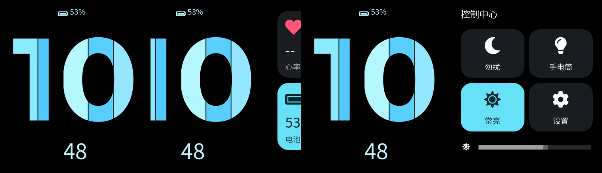
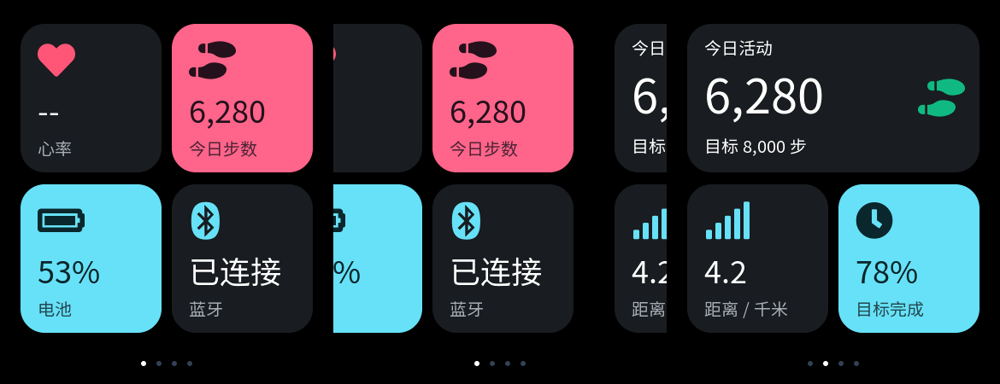

# PC 交互验收

日期：2026-09-23。本机 Windows，固定 SDK 内的 LVGL 9.4.0。硬件尚未验证。

## 启动

在根项目的 VS Code，或打开 `ui/xml` 的 LVGL Pro Editor 中，运行任务 **WristFlow: Run PC Simulator**。Editor 的任务菜单是 `Terminal > Run Task`；右侧 XML 预览仍用于单页外观检查。启动任务调用以下同一脚本：

```powershell
pwsh -NoProfile -ExecutionPolicy Bypass -File .\scripts\Simulate.ps1
```

脚本检查 SDK 锁定状态，配置并构建主机程序、运行三项 CTest，然后打开 **WristFlow - LVGL Simulator**。只编译与测试可加 `-BuildOnly`。再次构建前关闭已有模拟器窗口；脚本不会结束用户正在操作的窗口，也不会烧录。

本机依赖为 PowerShell 7、CMake 3.31.4、Ninja、MSYS2 UCRT64 GCC 15.2.0；默认主机工具目录 `D:/msys64/ucrt64/bin`，其他安装位置用 `-HostTools` 指定。沿用项目已有任务中的 PowerShell/Git 路径，其他机器须按实际安装调整。程序逻辑分辨率为 390×450，Windows 的显示缩放会改变窗口的物理像素大小。

## 本批操作

1. 启动显示固定 `10:48` 表盘，仍是样例时间。
2. 按住鼠标左键横向拖动，页面跟随移动；低速拖动未过半后停住再松手会回弹，过半会切换。快速滑动由 LVGL 动量预测决定是否切换。
3. 轮播顺序为表盘、心率布局、活动布局、系统布局、整页组件，再回表盘；反向也连续循环。第五页是布局演示，不是修改首版产品的三卡片环契约。
4. 回到表盘后向上滑，控制中心向上进入；在控制中心向下滑，返回表盘。横向拖动亮度滑块只改变控件数值，不改变电脑或开发板亮度。



上图来自 `ui_navigation` 的真实 LVGL 像素快照，顺序为启动、拖动中、取消后、控制中心。不是手绘 HTML，也不代表硬件显示证据。控制中心的进出采用短过渡动画，尚未实现纵向跟手或纵向取消回弹。无长按替换、配置保存、KEY1、RTC、通知、BLE、传感器或电源策略。

### 分页点固定修复

2026-09-23 用户发现信息页底部的点随内容横移。适配层现将 XML 生成的分页组件挂到固定的 home 层，保留原有四个信息演示页的点样式和映射；拖动中位置与高亮不变，吸附完成后切换高亮。表盘仍不显示分页点。镜像页复用同一份指示器，指示器不截获鼠标拖动，XML 与生成 C 均未修改。



`scripts/Simulate.ps1 -BuildOnly` 通过，三项 CTest 全通过；`ui_navigation` 新增拖动中坐标、短拖回弹、高亮更新、双向循环及从点上起拖的断言。日志为 `artifacts/fixed-indicator-host.log`。`scripts/Build.ps1 -Example ui_demo -Jobs 4` 编译链接与产物检查通过，记录在 `artifacts/ui_demo/20260923-223941-323/` 和 `artifacts/fixed-indicator-firmware.log`：main.bin 为 3,026,700 字节，SHA-256 `300cf45ababe9aff5931dcd6c1c230ce740899c3b0c5476aacb9064af345f1dc`。云端结果以修复 PR 的最新检查为准；尚无硬件验证。

下一项有界检查：在 PC 窗口横拖、短拖取消和首尾循环时，确认底部仅有一组固定指示点；主观拖拽验收后再继续长按替换与保存。

## XML 与 C 的分工

LVGL Pro 确实提供桌面模拟器路径：[Built-in Simulator](https://lvgl.io/docs/pro/integration/simulator)、[VS Code project](https://lvgl.io/docs/pro/integration/vscode)。本机 Editor 2.0.1 的创建页也提供 VSCode 模板。现有 `ui/xml` 是 UI-only 项目，没有自带 `sim/`；当前官方模板默认获取 LVGL 9.5.0，不适合直接覆盖固定 SDK。

本项目复用同一官方 **Win32 显示与鼠标驱动**，在 `apps/simulator/main.c` 建立轻量主机入口，并复用已有 `tests/CMakeLists.txt`、官方导出源清单及内嵌图片/字体。不另取 LVGL，不复制新的 XML 项目，不依赖付费 CLI。

- `ui/xml`：布局、样式、资源及官方生成 C；本次未修改 XML 或生成 C。
- `apps/ui_demo/src/ui_demo.c`：演示适配层，由 PC 与黄山派 UI Demo 共用，负责挂载页面、滚动吸附与控制中心导航。
- `apps/simulator/main.c`：仅负责 Windows 窗口、输入和 LVGL 主循环。
- 后续 `watch_core`：产品状态、长按意图、同尺寸替换与保存，不放入 XML 或生成文件。

LVGL 顶层 screen 不允许重设 parent。适配层创建无边框的等尺寸容器，继承现有页面根的背景/文字样式，将生成的子控件树挂入容器。横向手感使用 LVGL 原生 `SCROLL_ONE`、居中吸附和动量；首尾两个镜像页在吸附完成后无动画复位，图片和字体仍共享静态资源。未来增加页面根样式时须复核挂载后的外观。

## 验证与失败记录

- 源码检查：SDK 与生成 UI 保持原版本；演示逻辑从板端 `main.c` 提取后由两端共用。XML 仍只维护视觉。
- 主机测试：`clock_format`、`ui_preview`、`ui_navigation` 共 3/3 通过。新增测试通过 LVGL 输入定时器提供坐标与按压状态，覆盖按住时的位移、低速短拖回弹、过半切换、未过半快滑、双向两轮循环、控制中心重复进出与滑块；测试开启实际绘制与动画，生成四张额外 PPM。
- 窗口检查：已实际看到原生窗口渲染表盘；用户确认最初导航版可横滑，并要求优先补跟手。新版跟手另由上述输入测试及过渡快照证明，不把用户对初版的确认扩大为新版全部主观手感验收。
- 本机固件：Hello、BLE、Bringup、UI Demo 四项目均编译、链接及产物校验通过，具体记录如下；云端结果以本 PR 最新 `Firmware / Build baselines` 为准。
- 硬件：未烧录，显示/触控/KEY1/BLE/功耗/续航均未验证。

| 目标 | 本机记录目录 | main.bin 字节 | SHA-256 |
|---|---|---:|---|
| Hello | `artifacts/hello/20260923-215848-527/` | 300336 | `5d1e396f2e9cd6edd35f0586d2c30dbd7f3dd4cf0f42a5bcf17c9a976e4173c0` |
| BLE | `artifacts/ble/20260923-215924-035/` | 490064 | `09d17264a1822a45731664091785dea1b0a0324f5be2af46f32c154500d396d2` |
| Bringup | `artifacts/bringup/20260923-215948-790/` | 614176 | `deadadab94b802be43bbd3eeab9580de1828c28fafa679c9254b9334984895fb` |
| UI Demo | `artifacts/ui_demo/20260923-220036-379/` | 3026556 | `9618c8304e3094046a6514aff2fbef98fe89c47ad6e84855eb889d3906beac14` |

固件命令为 `scripts/Build.ps1 -Example <hello|ble|bringup|ui_demo> -Jobs 4`，由 PowerShell 7 执行；仍使用 Python 3.13.15、SCons 4.10.1、Arm GNU 14.2.Rel1/GCC 14.2.1 和锁定 SDK。前三项主固件哈希不变。最终 `Simulate.ps1 -BuildOnly` 退出 0，三项 CTest 通过；运行窗口存在时同一命令按预期退出 1，提示关闭当前窗口。窗口禁止调整大小和最大化，以保留固定页面几何。

失败及处理：早期 Win32 `simulator_mode=true` 配置出现白屏和 `No draw buffer`，临时添加应用缓冲也未解决；最后按本机官方模板采用 `false, false`，由驱动管理 framebuffer，窗口恢复渲染。9.4 驱动在创建窗口的线程中获取 LVGL 锁，主线程不能持锁等待创建；只在 display 创建完成后锁住 UI 初始化。运行中的 EXE 无法被链接器覆盖，脚本现提前提示关闭窗口。加入控制中心动画后，原测试仅手动读取一次释放事件导致下一次输入被吞；改为持续运行 LVGL 输入定时器后通过。

本机记录：`artifacts/simulator-build/Testing/Temporary/LastTest.log`、`artifacts/simulator-build/renders/navigation_*.ppm`、`artifacts/simulator-final-build.log`、`artifacts/simulator-launch.log`、`artifacts/simulator-{hello,ble,bringup,ui_demo}-build.log`。SDK 官方编译告警仍保留。历史根目录 `huang.html` 是黄山派官方 Wiki 指南下载件，不参与构建，已移入忽略目录 `artifacts/reference/huang.html`；SHA-256 为 `f3e7174a19d8a0132c9a0bca32c174ddf6d3d8ca7ad0fa341b7cf1a4fcf6b14b`，内容保留。

下一项有界验收：用户在当前窗口检查新版拖拽的实际手感；通过后接 `watch_core` 的长按同尺寸替换与保存。板到货后先走 Bringup 到货验收，PC 测试不替代板端帧率、触摸或功耗实验。
