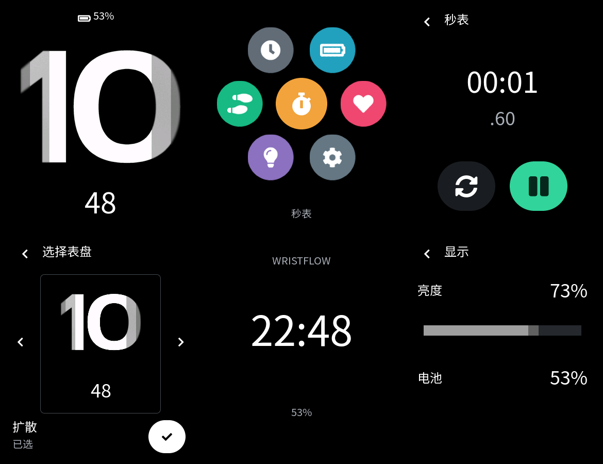

# 菜单与应用：首个可操作版本

本页保留 PR #14 首版记录。后续真机反馈、自由拖动、滑动选表盘、独立占位页及调度测量见 [触摸修正与调度核验](UI-TOUCH.md)，以下箭头选择等旧操作已被替换。

更新：2026-09-25。此前只有卡片轮播与控制中心；本次把白灰扩散、蜂窝菜单、秒表、表盘选择、亮度和手电筒接入同一份 PC/黄山派 UI Demo。先验收完整操作，再打磨图标、扩散材质和过渡。没有烧录本版固件。

## 开始测试

本次代码位于隔离工作区 `C:/Users/13984/.codex/worktrees/ui-shell/wristflow`，分支 `codex/launcher-flow`。原 `D:/MY_Desk/project/wristflow` 的未提交烧录工具和到货记录保持原样。

已经编译的最终模拟器：`artifacts/acceptance-build/wristflow_simulator.exe`。若此前的 `launcher-build` 窗口仍开着，请关闭后运行这个新版。也可在本工作区运行：

```powershell
pwsh -NoProfile -File .\scripts\Simulate.ps1
```

该脚本重建、运行 6 项 CTest，再打开窗口；`-BuildOnly` 只构建测试，不打开窗口。它不烧录。Windows 缩放可能放大窗口，程序逻辑尺寸仍是 390×450。

| 操作 | 应看到的结果 |
|---|---|
| 表盘短按 Enter；板端为 KEY1 短按释放 | 打开七图标蜂窝菜单。任意其他页面按此键回主页；在信息卡片上按键先回表盘 |
| 在菜单拖动，松开后点橙色秒表图标 | 菜单能平移，图标随距中心距离缩放；拖动不误开应用。底部显示最近中心的应用名称 |
| 秒表点绿色按钮，返回菜单，等几秒再进入 | 秒表持续计时；再次点绿色按钮暂停；左侧重置按钮清零并停止 |
| 应用点左上返回，或从左侧 40px 内向右滑；PC 也可按 Esc | 返回入口页面。经菜单进入则回到原滚动位置；经控制中心进入则回控制中心 |
| 表盘按住约 0.5 秒后松开 | 打开选择页，松手不会误选。左右箭头切换“扩散/简洁”，勾选应用并回主页；返回只取消预览 |
| 换成简洁，再横滑卡片、进入控制中心/菜单后回主页 | 仅主页表盘改变，原卡片、导航与所选表盘保留。当前仅在本次运行保留，重启恢复扩散 |
| 表盘上滑 → 设置 → 拖亮度 → 返回 | 设置和控制中心共用 10%–100% 数值。PC 不改变电脑亮度；板端接入 LCD 亮度控制，实际效果待上板 |
| 从菜单或控制中心开手电筒，再点屏幕/返回/按 Enter | 全白页面；板端请求 100% 亮度，退出恢复先前用户亮度 |

心率、活动、系统图标目前打开原有示例信息页面，不代表真实测量。原卡片轮播、固定分页点及整页组件展示仍可横滑查看；布局/组件选择 XML 仍保留，尚未接入用户编辑流程。

勿扰和常亮按钮保留但禁用，等待通知/电源策略。时间 `10:48`（简洁为 `22:48`）和电量 `53%` 仍为演示输入；秒表使用单调 tick，是真实交互计时。RTC、通知、BLE、传感器、熄屏唤醒、重启保存和开机动画未纳入本次实现。

## 外观与结构



图片由已编译生成 C 的 LVGL `lv_snapshot_take` 输出，不是重新绘制的网页；不构成板端显示证据。补齐了 1–12 点白灰小时资源。10/11/12 按整组覆盖两侧毛玻璃，分界平直，外层与内层宽度约 1:2；新补数字造型与材质仍待主观验收。

蜂窝采用七个错列六边形邻接位置、原生双向滚动和公开的 LVGL 缩放 API。参考了固定 SDK 官方 Watch 的 `app_mainmenu.c` 布局/中心缩放思路；原例程依赖 LVGL 8 的 GUI 框架、私有字段和预编译 `cell_transform`，没有整体移植。当前是独立最小实现，图标来自已有 FontAwesome 子集，尚不是官方菜单的完整动效复刻。

| 文件 | 边界 |
|---|---|
| `core/watch_core.*` | 有限页面状态与返回来源；不建通用页面栈 |
| `core/stopwatch.*` | 纯 C 累计计时、暂停、重置和 32 位 tick 回绕处理，不依赖控件 |
| `ui/runtime/ui_shell.*` | 原卡片轮播、长按与边缘手势、切屏保护、KEY/Back、表盘生命周期 |
| `ui/runtime/apps.*` | 懒创建并保留应用页、按钮绑定、菜单偏移、秒表显示、最小两表盘目录、共享亮度 |
| `ui/runtime/*watchface*` | 现有描述符接口；扩散与简洁是两个独立实现，替换只影响主页实例 |
| `ui/xml/` | 外观、控件命名、字体/图片及官方导出的 C；行为不写进生成文件 |
| `apps/ui_demo/src/main.c` | KEY1 回调只发 RT event；UI 主循环消费，LCD 亮度回调也在 UI 线程执行 |
| `apps/simulator/main.c` | 官方 Win32 pointer/keypad；Enter/Esc 映射至共用导航 |

秒表暂停时停止其定时器；运行且可见时约 40ms 更新，后台每秒累计且不更新隐藏标签。应用页与菜单只在首次进入时创建，退出保留状态，shell 销毁时统一释放。后续新增表盘先加独立描述符及本地选择项；有真实配置需求后再设计保存结构，不预建插件系统或万能配置表。

## 验证与构建

- **源码/资源检查**：固定 SDK/submodules 没有修改。XML 格式检查通过；Editor 2.0.1 官方 GUI 导出并编译成功，预览与固件均为 LVGL 9.4.0。生成清单包含 6 个新 screen、2 个组件、`clock_80` 和全部小时图片；历史无引用 `hour_seven_data.c` 继续排除。
- **主机编译与测试**：GCC 15.2.0，`artifacts/acceptance-build` 最终 6/6 通过。保留原轮播/生命周期测试；新增真实 pointer 应用进出、菜单拖动不点击、偏移恢复、秒表后台/暂停/重置、长按释放、取消/应用表盘、亮度同步、手电筒恢复和重建。keypad 回归覆盖 Enter、Esc、按住抑制重复及释放后下一次输入；纯 C 测试覆盖 tick 回绕。
- **渲染检查**：检查八张真实 LVGL 页面快照及全套小时资源图；菜单“表盘”字形有显式测试。Windows 窗口已实际启动；最终版主观操作留给用户，桌面自动操作被用户 Esc 停止后没有继续。
- **板端编译**：UI Demo 编译链接和产物校验通过，记录 `artifacts/ui_demo/20260925-120930-955/`。`main.bin` 为 3,067,788 字节，SHA-256 `08717e700ad1be54a5e066cbdbf7a3f9daa41084baf0916ce223f8a8505d1c2d`。开启按钮库，PM/BLE 仍关闭。既有 SDK RWX/newlib/ftab 告警保留。
- **硬件**：本版未烧录。先前用户对基础固件和官方菜单的确认不扩大为本版触摸、KEY1、亮度、帧率、内存峰值或功耗通过。

四个目标均由同一官方环境复编译，SCons 4.10.1、Python 3.13.15、Arm GCC 14.2.1。完整版本、SDK/submodule 提交、四份固件 SHA-256 和本机 UI 源文件哈希见 [机器可读构建记录](evidence/2026-09-25-ui-apps/builds.json)。资源哈希记录构建时的本机文件字节，生成 C 的换行可能被 Git 规范化。

| 目标 | 本机记录目录 | main.bin 字节 | 编译 / 产物校验 |
|---|---|---:|---|
| Hello | `artifacts/hello/20260925-121114-418/` | 300336 | 通过 / 通过 |
| BLE | `artifacts/ble/20260925-121126-563/` | 490064 | 通过 / 通过 |
| Bringup | `artifacts/bringup/20260925-121149-288/` | 614176 | 通过 / 通过 |
| UI Demo | `artifacts/ui_demo/20260925-120930-955/` | 3067788 | 通过 / 通过 |

最终命令（本机隔离工作区）：

```text
cmake -S tests -B artifacts/acceptance-build -G Ninja -DCMAKE_BUILD_TYPE=Debug -DCMAKE_C_COMPILER=D:/msys64/ucrt64/bin/gcc.exe -DCMAKE_MAKE_PROGRAM=D:/msys64/ucrt64/bin/ninja.exe -DWRISTFLOW_BUILD_SIMULATOR=ON
cmake --build artifacts/acceptance-build -j 6
ctest --test-dir artifacts/acceptance-build --output-on-failure
pwsh -NoProfile -File artifacts/build-isolated.ps1 -Example ui_demo
pwsh -NoProfile -File artifacts/build-isolated.ps1 -Example hello
pwsh -NoProfile -File artifacts/build-isolated.ps1 -Example ble
pwsh -NoProfile -File artifacts/build-isolated.ps1 -Example bringup
```

隔离构建助手沿用 [框架记录](UI-RUNTIME.md#隔离工作区构建) 的官方离线环境检查/导出方式，底层为 `scons --board=sf32lb52-lchspi-ulp -j6`。正常 checkout 与 CI 仍运行 `scripts/Build.ps1 -Example ui_demo`。本次没有改 SDK 锁、烧录脚本或官方链接布局。

资源脚本使用 `uv run --no-project --with pillow --with fonttools scripts/Generate-Ui-Assets.py`，只生成字体子集和 PNG；C 由官方 Editor 的 Export Code and Recompile 生成。主机测试日志在 `artifacts/acceptance-build/Testing/Temporary/LastTest.log`，快照在其 `renders/`。

本次修复记录：初次 Python 缺少 fontTools，改用隔离 uv 依赖；XML 的 `scroll_dir` 不受支持，移动到行为层；图片 pivot 的 `int|%` 导出失败，改用 XML 的固定尺寸/`inner_align="stretch"`；C helper `bind` 与 Windows socket 名冲突，更名；初版键盘把 KEY 事件参数误作 indev，改用 `lv_event_get_key`/`lv_indev_active` 并增加真实 keypad 回归；菜单标题缺字，缩为“表盘”并检查字形；一次主机构建被外部中断，保留记录并在同目录重建完成。

## 下一项有界验收

先按表格完整操作一轮 PC 版本，反馈具体入口、动作和实际结果。随后将相同源码的 UI Demo 上板，重点检查蜂窝拖动帧率、左缘返回、长按误触、KEY1 和亮度恢复；记录后再进入 RTC/保存或视觉优化。两种验证独立，不以 PC 成功替代硬件成功。
