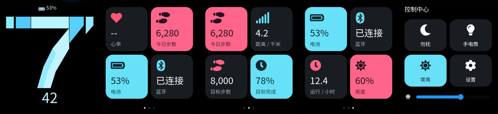

# XML 视觉演示与操作步骤

日期：2026-09-23。硬件尚未到货。用户参考图决定本轮画面：黑底、大号分面小时、小号分钟及电量；横向信息环采用 2×2 信息块和分页点。参考照片未提交到公开仓库。



## 本轮结果和范围

- `screen_watchface.xml`：12 小时制的静态 `10:48` 外观样例，小时不补前导零、分钟固定两位；`hour_1.png` 至 `hour_12.png` 提供完整的小时资源，但尚无 RTC 更新。
- `screen_tile_heart_rate.xml`、`screen_tile_activity.xml`、`screen_tile_system.xml`：沿用固定槽位容器的心率、活动和系统信息页。
- `screen_tile_full.xml`：342×362 的整页组件样例；`screen_layout_picker.xml` 提供四种布局模板选择。
- `screen_picker_quarter.xml`、`screen_picker_half.xml`、`screen_picker_full.xml`：分别演示三种规格的组件选择页，列表可纵向滚动，内容仅按同尺寸替换。
- 三种固定槽位为 `quarter` 165×174、`half` 342×174、`full` 342×362；区域起点 `(24,28)`，列/行间距为 12/14 px。四种模板为四个 quarter、上半 half+下方两个 quarter、上方两个 quarter+下半 half、一个 full。
- `screen_control_center.xml`：勿扰、手电筒、常亮、设置和亮度滑块外观。按钮未连接业务，滑块仅改变控件值，不改变硬件亮度。
- `tile_grid.xml`、`tile_quarter.xml`、`tile_half.xml`、`tile_full.xml`、`metric_half.xml`、`metric_full.xml` 和 picker 组件承担可复用的几何骨架；具体页面只替换图标、文字、颜色和示例数据。字体、图标和图片实际参与官方导出及固件编译。

XML 只负责视觉。`apps/ui_demo/` 的少量 C 适配代码提供表盘、三页信息环、整页组件和选择页的静态加载；尚未在 PC 或真机执行完整设备手势，不把静态编辑器切页截图当成手势通过。长按后的同尺寸替换和配置保存尚未接入 `watch_core`。该演示不包含 KEY1、电源策略、BLE 或传感器实现，不代替 `watch_core` 或到货 Bringup 验收。

## 本机免费版操作

1. 启动现有 `D:\lvgl_pro\lvgl_editor\LVGL_Pro_Editor\LVGL_Pro_Editor.exe`，本轮版本为 **2.0.1**。无需为本轮另装编辑器。
2. `Account` 是账号菜单；`Manage License` 是管理许可。选择 **Community License / No Expiry**，表示社区许可/无到期日。用户已登录，本轮已选中并复查。`NON-COMMERCIAL USE ONLY` 表示仅限非商业用途，不是报错。没有新申请表或待填写资料。
3. 打开 `D:\MY_Desk\project\wristflow\ui\xml`，这是含 `project.xml` 的项目目录。LVGL 版本为 **9.4.0**，目标为 `huangshan_390x450`，主题 `simple`。
4. 左侧打开 `screens/*.xml` 查看右侧实际 LVGL 预览。修改 XML 后通常自动刷新；新增字体、图片时应重新编译预览。缩放菜单 `Reset zoom` 或 `Ctrl+0` 恢复 100%，检查完整的 390×450 画面。
5. 右侧锤子按钮 **Export Code and Recompile**，或 `Ctrl+B`，导出 C 并编译预览。`Ctrl+E` 只导出，`Ctrl+Shift+B` 为完整重建。以输出区 **Project compiled successfully** 为成功证据。
6. 导出文件就在 XML 项目中：`*_gen.c/h`、`fonts/*_data.c`、`images/*_data.c` 及 CMake 文件。`wristflow_ui.c/h` 是官方创建的自定义入口，本轮保持其初始化转发。业务代码放在 app/适配层，不改生成文件。
7. 在 VS Code 执行 **WristFlow: Build UI Demo**，或运行下方 PowerShell 命令。修改 XML 后先在 GUI 导出，再编译固件；CI 不能替你运行 Community 官方 CLI。

```powershell
pwsh -NoProfile -ExecutionPolicy Bypass -File .\scripts\Build.ps1 -Example ui_demo -Jobs 4
```

## 本轮实际踩坑

| 现象 | 原因与处理 |
|---|---|
| 旧页面文字挤在左上、字体很小 | Gemini XML 的 `remove_style_all` 清除属性设置，且没有实际大号/中文字体。显式设置 geometry/style，绑定字体资源 |
| `No font was found`、`unable to open A:fonts/...` | 最初文件未生成或预览还没重新打包。确认项目相对路径和文件存在后，用 GUI 编译；不随意改成机器绝对路径 |
| `Invalid enum value 'ARGB8888'` | 图片 `color_format` 枚举是小写 `argb8888` |
| `e.add_usage is not a function` | v2.0.1 导出器对空格分隔的多个字体范围处理失败；使用一个连续范围，字体文件自身先裁剪 |
| 图标字体提示默认 `0x20-0x7F` 范围无字符 | 显式指定 `0xf004-0xf54b` 等范围；不能只依赖 `symbols` 使默认 ASCII 范围失效 |
| 临时 tiny_ttf 预览报 `cache not allocated` | 未成功编译时使用的临时字体路径；成功导出内嵌 bitmap 字体并编译后不再出现 |

字体资源来自锁定 SDK 内的 Noto Sans SC 和 Font Awesome，使用 fontTools 4.60.1 裁剪并更名；许可随资源提交。小时图像使用 Pillow 11.3.0 生成，12 张 342×282 的 RGB565 静态图片，未压缩像素数据合计约 2.21 MiB。它们不是分片动画；呼吸/伸缩效果按用户决定延后到硬件到货后，再以局部刷新、帧率和功耗实测决定。字体只覆盖演示字形，不用于任意通知文字。编译产物中保留这些资源的实际成本。

## 证据分层

1. Python `ElementTree.parse` 校验 `ui/xml/` 下 24 个 XML；这只证明格式良好。
2. 官方 Editor 2.0.1（LVGL 9.4.0、Community License）校验、C 导出和 Emscripten 预览编译成功；日志显示 `Project compiled successfully`。表盘、四种模板和三种 picker 页面均在 100% 预览核验边界；另生成 23 张 PPM 快照及联系图，未用 HTML 重画替代。
3. 主机 CMake/CTest 的 `clock_format` 与 `ui_preview` 两项均通过（2/2），覆盖 1,440 个分钟值、12 小时制转换、三种 slot 几何、四种模板和 picker 纵向滚动，并生成 23 张快照。
4. 固定 SiFli-SDK `421126d9f476ed8e2a6f0b0ca28a9f241c182e65`，GCC 14.2.1、SCons 4.10.1、SDK Python 3.13.15；`ui_demo` 在黄山派目标上本机编译链接、镜像清单校验均成功，`main.bin` 为 3,025,908 B。`LV_USE_XML=0`，`LV_USE_OBJ_NAME=1`，PM/BLE 关闭。生成 C、字体和图片全部纳入 SCons，源文件哈希进入 `result.json`。
5. Hello/BLE/Bringup 同时复编译通过；云端以本 PR 最新 `Firmware / Build baselines` 为准，CI 不验证 GUI 导出新鲜度或像素。
6. 没有烧录或硬件运行，显示、触控、KEY1、BLE、功耗和续航均未验证。

| 本机目标 | 记录目录 | main.bin 字节 |
|---|---|---:|
| UI Demo | `artifacts/ui_demo/20260923-094649-256/` | 3025908 |
| Hello | `artifacts/hello/20260923-095016-488/` | 300336 |
| BLE | `artifacts/ble/20260923-095042-519/` | 490064 |
| Bringup | `artifacts/bringup/20260923-095112-547/` | 614176 |

UI Demo SHA-256：`e34951ad3a3f707634eb17d5b6a04e06a8cdb97e943b848ac935f8b2d22a1849`。保留 SDK 原有 RWX、`lv_obj_tree.c:274`、ftab syscall/entry 警告，未抑制或修改 SDK。机器可读摘要见 `artifacts/ui_demo/20260923-094649-256/result.json`。

手势适配依赖 SDK `lv_obj.c:582` 默认给子对象设置的 `LV_OBJ_FLAG_GESTURE_BUBBLE`；当前 XML 没有清除该标志，实际效果仍待运行验证。17 个本轮含中文的文本文件（含本机 skill）严格 UTF-8 解码和限定乱码检查通过。手写文件的空白检查通过；官方生成 C 的末尾空行和字体许可证原有行尾空格保持原样。

## 下一项有界实验

下一项是把四种布局模板、slot 名称、同尺寸替换和长按意图接到具有 PC 单元测试的 `watch_core`，再由 UI Adapter 接入页面加载和数据更新。不要让 demo 的静态“已连接”、样例数据或选择页行为自动成为产品行为。板到货后先执行 ACCEPTANCE；数字分片动画另记为硬件到货后的局部刷新、帧率、功耗和变暗/息屏停止条件实验，不直接跳到 UI demo 烧录。

参考：[官方字体](https://lvgl.io/docs/pro/syntax/fonts)、[官方图片](https://lvgl.io/docs/pro/syntax/images)、[许可及审核](LVGL-PRO.md)、[构建基线](BUILD.md)。
