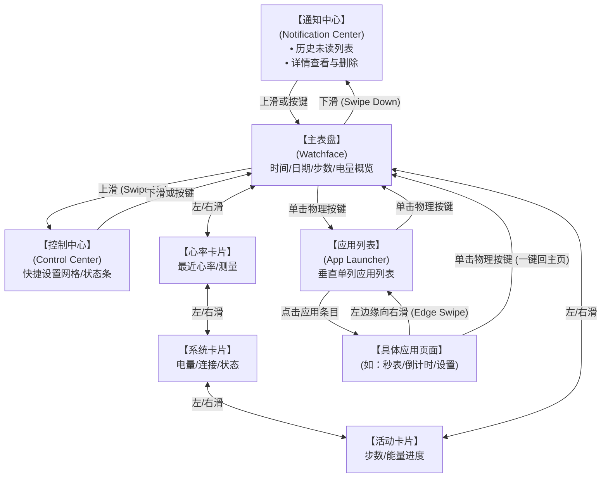
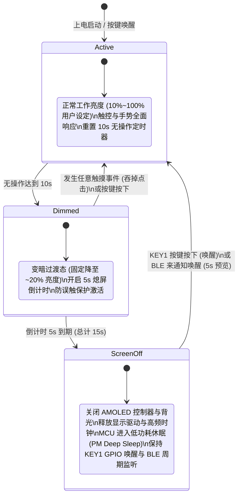
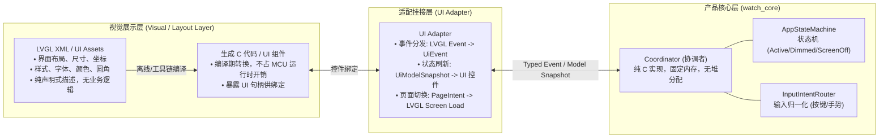

# WristFlow 交互规格与状态机契约

更新日期：2026-09-22。阶段：立创黄山派硬件在途（等板期）。
本文件定义 WristFlow 智能手表的全局交互拓扑、手势与按键映射、亮灭屏电源状态机、核心页面规范、LVGL XML 视觉解耦架构契约，以及 Redmi Watch 4 实拍参考索引。

---

## 1. 物理平台与输入输出边界

- **主控平台**：立创·黄山派 SF32LB52-ULP（SF32LB525UC6，8MB PSRAM + 16MB NOR Flash，SDK 板名 `sf32lb52-lchspi-ulp`）。
- **显示屏**：1.85 英寸 AMOLED，分辨率 **390 × 450**（16-bit RGB565，CO5300 驱动，SPI/QSPI 接口）。
- **触控输入**：FT6146 电容式多点触摸芯片（当前按单指手势驱动，首版触摸唤醒关闭，以按键唤醒为主）。
- **物理输入**：单实体按键 **KEY1**（PA34，高电平有效，带防抖与 AON Pin Wakeup 支持）。
- **触觉反馈**：板载马达驱动焊盘外接振动电机（首版电机型号待定）。
- **功耗基准模型**：每日 45 分钟亮屏交互 + 30 次通知（5 次打开处理）+ 24h BLE 逻辑连接 + 心率间歇采样（目标 7 天续航路线）。

---

## 2. 全局手势导航拓扑（Redmi Watch 4 对标）

导航模型严格参照 **Redmi Watch 4** 的交互逻辑：以主表盘为原点，四向手势对应四大快捷入口，单实体按键负责应用列表展开与主页返回。

### 全局手势与按键映射表

| 场景 / 界面 | 手势 / 输入事件 | 动作与目标页面 | 动画与交互特征 |
|---|---|---|---|
| **主表盘** | 下滑 (Swipe Down) | 进入【通知中心】 | 页面从顶部顺滑下落展开 |
| **主表盘** | 上滑 (Swipe Up) | 进入【控制中心 / 快捷设置】 | 页面从底部向上滑出 |
| **主表盘** | 左右滑 (Swipe Left / Right) | 切换【核心卡片 (Tiles)】 | 无限环形滚动，支持弹性阻尼与未过半取消回弹 |
| **主表盘** | 单击实体按键 KEY1 | 进入【应用列表 (Launcher)】 | 垂直列表平滑载入，恢复上次离开时的 offset |
| **主表盘** | 长按实体按键 KEY1 (3s) | 弹出【电源选项菜单】 | 重启、关机、进入长续航模式 |
| **核心卡片** | 左右滑动 | 切换相邻卡片或回表盘 | 横向连续切换 |
| **核心卡片** | 单击实体按键 KEY1 | 直接返回【主表盘】 | 快速一键回主界面 |
| **二级页面 / 应用内** | 屏幕左边缘向右划 (0~40px) | 返回上一级 (Back) | 边缘手势切页；若需跟手感，板上评估实时平移与 1/3 阈值取消吸附 |
| **二级页面 / 应用内** | 单击实体按键 KEY1 | 直接返回【主表盘】 (Home) | 放弃当前所有深层栈，一键回主界面 |
| **任意亮屏界面** | 无操作超时 (默认 10s) | 进入【变暗过渡态 (Dimmed)】 | 屏幕平滑降到约 20% 亮度 |
| **变暗过渡态** | 再次超时 (默认 5s，总计 15s) | 进入【息屏休眠态 (Screen-Off)】 | 关断 AMOLED 显示控制器与背光驱动 |
| **变暗过渡态** | 任意触摸事件 | 恢复正常亮度，**吞掉点击** | 仅提亮并重置计时器，防误触底层控件 |
| **息屏休眠态** | 单击实体按键 KEY1 | 唤醒屏幕 (Wake Up) | 短暂息屏恢复原页面；长息屏 (>2min) 回主表盘 |

---

## 3. 核心页面详细规格

### 3.1 核心卡片环（Tiles Ring）

首版配置 **3 张功能卡片 + 1 个主表盘**，组成无限环形循环：
`[心率卡片]` <-> `[主表盘]` <-> `[今日活动/步数卡片]` <-> `[电量与系统状态卡片]`

- **手感要求**：手指左右拖拽时，卡片跟随移动；手指滑动位移未过屏幕宽度 1/2 且速度较低时松手，自动平滑弹回当前卡片（取消切换）；位移超过 1/2 或轻微快速滑掷（Fling）时顺畅切换至相邻卡片。
- **内容定义**：
  1. **主表盘**：数字时钟（大字体）、日期/星期、步数简报、电量环形条。
  2. **心率卡片**：最新测量心率数值（BPM）、测量时间戳、24h 简要区间条形柱状示意、即时单次“测量”触控按钮。
  3. **今日活动卡片**：步数总量、距离估算、目标圆环进度条（基于黄山派板载 LSM6DS3TR-C IMU 数据）。
  4. **系统状态卡片**：电池电量精确百分比、充放电状态、BLE 逻辑连接状态、设备运行时间。

### 3.2 通知中心与新消息提醒

- **新通知到来交互（息屏态）**：
  1. 手机端通过 BLE 推送通知包到达固件。
  2. 若【勿扰模式 (DND)】关闭：硬件马达触发 **双短振**（150ms ON - 100ms OFF - 150ms ON）。
  3. 点亮 AMOLED 屏幕，直接展示 **通知预览卡片**（展示 App 图标、标题、首行正文）。
  4. 启动 **5 秒无操作倒计时**：若用户在 5 秒内未触碰屏幕，屏幕自动恢复熄灭休眠；若用户点击卡片，进入完整详情；若用户上划，收起卡片并保持亮屏。
- **新通知到来交互（亮屏活跃态）**：
  - 屏幕顶部滑下一个轻量横幅（Banner Toast），展示 3 秒后自动向上收起，不中断用户当前的表盘或应用操作。
- **通知中心列表（表盘下滑展开）**：
  - 采用时间倒序垂直流式卡片列表（首版内存环形缓冲区最多保留 10 条）。
  - 单条卡片点击展开查看完整文本（支持多行排版）。
  - 详情页支持【左滑删除】按钮；通知列表底部提供【清空全部】操作项。

### 3.3 控制中心 / 快捷设置（Control Center）

- **入场与布局**：表盘由下向上滑出；整体布局参数化（预留 3×3 或 2×2 大图标网格，待硬件到货后根据 390×450 实际视野与触控热区最终敲定）。
- **顶部状态栏**：紧凑展示电池电量百分比（如 `85%`）与 BLE 连接小图标。
- **首版 4 大核心开关（2×2 铺满一屏）**：
  1. **勿扰模式 (DND)**：一键切换开/关；开启后屏蔽通知振动与息屏点亮。
  2. **手电筒 (Flashlight)**：点击进入全屏纯白 100% 亮度页面；点击任意处或右滑退出恢复原亮度。
  3. **临时常亮 5 分钟 (Keep Screen On)**：点击临时禁用 15s 息屏计时，维持 5 分钟常亮，超时自动恢复。
  4. **系统设置入口 (Settings)**：点击直接跳转至设置应用。
- **退场逻辑**：下滑手势或单击物理按键即时收起，返回主表盘。

### 3.4 应用列表（App Launcher）

- **形态**：垂直单列滚动列表，左侧 48×48 圆角应用图标，右侧应用名称文字标签。
- **滚动与阻尼**：滑动流畅，到达顶部与底部时具有平滑的弹性阻尼。
- **列表滚动位置记忆契约（硬性要求）**：
  - 当用户在列表中滚动到某一位置（例如第 5 个应用）并点击进入该应用；
  - 随后从应用中通过右滑或按键返回应用列表时；
  - **应用列表必须精确恢复在离开前的滚动像素偏移量（Scroll Offset）**，禁止重置回列表顶部。
- **首版基础应用集合**：
  1. 心率（单次测量、心率记录）
  2. 计时器（秒表、倒计时）
  3. 闹钟（简单闹钟设置）
  4. 设置（亮度滑块、熄屏时间、勿扰、电量信息）

---

## 4. 电源与多级亮灭屏状态机（Power State Machine）

为实现 45 分钟亮屏 + 7 天续航的严苛功耗目标，手表的显示与主控状态机必须具有严密的多级降级机制：

### 状态机核心契约细则

1. **变暗态防误触契约（Anti-Misclick Policy）**：
   - 处于 `Dimmed` 变暗过渡态时，用户的首次触摸操作**仅用于唤醒屏幕**（将屏幕提亮回原设定值并重置 10s 活跃定时器）；
   - 该触摸事件必须被状态机拦截（Consume/Eat Event），**严禁穿透**到底层界面的按钮、开关或列表项，防止因变暗盲点造成误操作。
2. **息屏后页面栈恢复契约（Page State Retention Policy）**：
   - 当屏幕由 `Dimmed` 转为 `ScreenOff` 彻底熄屏时，状态机保存当前 `PageManager` 页面栈快照及熄屏时间戳；
   - **短时间息屏唤醒（< 2 分钟）**：重新按键点亮时，直接恢复在熄屏前的页面（例如用户正在看心率或在设置菜单）；
   - **长时间息屏唤醒（≥ 2 分钟）**：重新按键点亮时，自动丢弃深层栈，重置返回到【主表盘】；
   - **特例豁免**：若熄屏前正在运行【秒表计时】或【倒计时】，无论息屏多久，唤醒后始终保持在计时界面。

---

## 5. 振动触觉反馈契约（Haptic Policy）

在板载电机驱动外围特性（转子马达 vs 线性马达延迟）最终实测验证前，采用保守省电策略：

1. **允许振动场景**：
   - 新通知到达：双短脉冲（150ms 振动 - 100ms 停顿 - 150ms 振动）。
   - 闹钟 / 倒计时到期：连续周期长脉冲（每振动 500ms 停顿 500ms，持续直至用户手动点击停止或达到 30s 上限）。
2. **禁止振动场景**：
   - 屏幕滑动、卡片切页、列表滚动阻尼、开关切换、按键按下等常规交互一律**不触发振动**（节省功耗并避免转子马达启停拖沓影响手感）。
3. **全局勿扰约束**：
   - 开启【勿扰模式 (DND)】后，除闹钟外，一切通知振动静音。

---

## 6. 技术实现架构：LVGL XML 视觉解耦与 watch_core 纯 C 核心

参考 `magic_watch` 的架构实践，为保证未来在黄山派板载与 PC 模拟器之间的顺畅复现与测试，严格实行**视觉布局与产品逻辑双层解耦**：

### 架构职责边界约束

1. **视觉展示层 (LVGL XML)**：
   - 负责：定义卡片、表盘、列表、通知横幅的视觉骨架、尺寸比例、间距、颜色与图片资产；
   - 严禁：在 XML 或 UI 自动生成代码中编写具体的业务跳转逻辑、硬件外设调用或状态变量。
2. **产品核心层 (`watch_core`)**：
   - 纯 C 语言编写，**零动态内存分配 (Zero-heap allocation)**，内存占用固定可预测；
   - 严禁：`#include` 任何 LVGL 头文件、显示屏驱动、RT-Thread 系统调用或特定硬件 API；
   - 保证：`watch_core` 可以在任何平台（PC 命令行单元测试、跨平台模拟器、MCU 目标板）无缝编译并接受回归测试。
3. **适配挂接层 (UI Adapter)**：
   - 仅在此层包含 LVGL 头文件与 `watch_core` 头文件，负责两者之间的状态搬运与事件派发。

---

## 7. Redmi Watch 4 实拍参考图索引与待补拍清单

项目中已有的历史参考照片位于 `D:\MY_Desk\project\watch\image_temp\XiaoMiWatch\`：

### 7.1 已有实拍参考资源库

| 功能模块 | 参考图片目录路径 | 包含参考内容 |
|---|---|---|
| **心率应用** | `image_temp/XiaoMiWatch/app/AppHeartRate/` | 心率测量数值排版、图表、说明文案 |
| **今日步数** | `image_temp/XiaoMiWatch/app/step/` | 步数大字、环形进度、距离卡片 |
| **小组件卡片** | `image_temp/XiaoMiWatch/组件/` | Watch 4 左右滑动时的卡片组件比例、圆角 |
| **系统设置** | `image_temp/XiaoMiWatch/set/disp/` | 显示设置菜单、亮度滑块、熄屏时间单选项 |

### 7.2 后续待补拍清单（用户可根据本表在手边真机实拍补充）

为进一步精细化对齐视觉参数，后续可在有空时补充以下特定界面的实拍照片：

- [ ] **照片 1：【主表盘正面正视实拍】**：标准默认表盘在 390×450 屏幕上的元素排布、边距与色彩对比。
- [ ] **照片 2：【通知中心列表与详情实拍】**：表盘下滑后，多条通知在屏幕上的垂直堆叠间距、图标大小及点开后的详情气泡。
- [ ] **照片 3：【控制中心快捷开关网格实拍】**：表盘上滑后，实际图标的大小、圆角、文字标签以及顶部状态栏布局。
- [ ] **照片 4：【垂直应用列表实拍】**：单击按键进入后，单个列表项的高度、图标尺寸与右侧文字字号。
- [ ] **照片 5：【新通知亮屏顶部横幅 (Banner) 实拍】**：手表在使用中收到通知时，顶部下压横幅的视觉宽度与边距。
- [ ] **照片 6：【左右滑动卡片切换过渡实拍】**：两张卡片在滑动交界处的视觉过渡与分割效果。

---

## 8. 下一步工程行动闭环

1. **等板期**：
   - 依据本文档，完成 `watch_core` 核心状态机与手势事件路由器（纯 C 头文件与单元状态机原型）；
   - 建立 LVGL XML 基础组件模板（对齐 390×450 布局）。
2. **硬件到货第一阶段（到货验收）**：
   - 按 `docs/ACCEPTANCE.md` 核验实物通电、Hello 串口、全屏纯色显示、触摸全区与 KEY1 按键响应。
3. **硬件到货第二阶段（交互上板）**：
   - 烧录上板，用实际手指滑动验收卡片切换、变暗防误触与按键一键回主页，实测视觉效果并微调控制中心网格参数。
