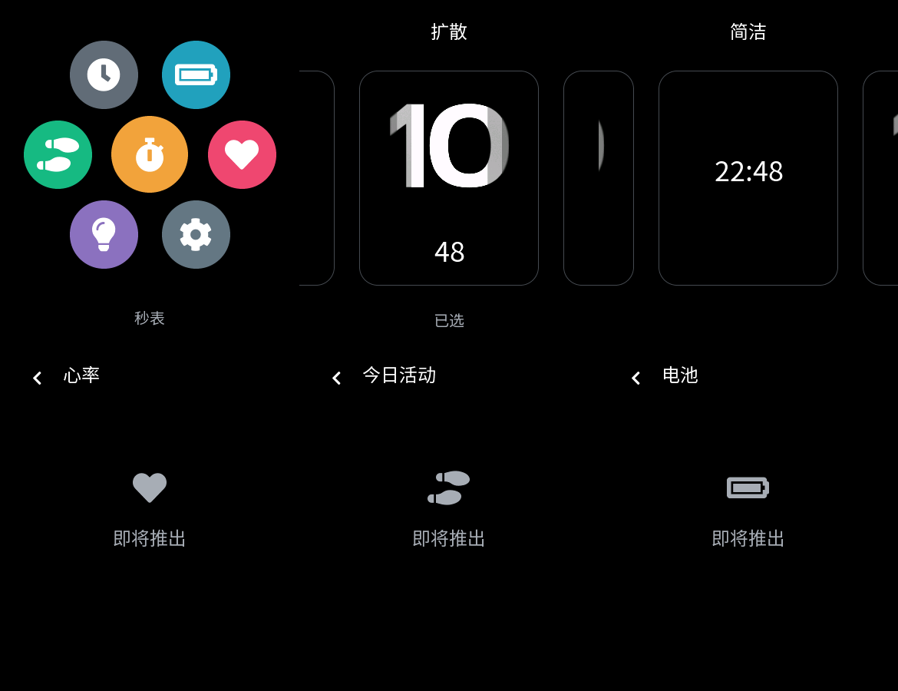

# 真机触摸反馈与调度核验

日期：2026-09-25。工作区 `C:/Users/13984/.codex/worktrees/ui-shell/wristflow`，分支 `codex/ui-touch-refinement`，基于 `21b4868`（PR #14）。用户已在上一版确认 KEY1、长按和左缘返回可用，同时报告蜂窝单轴拖动、滑条不跟手、选择页按钮多及应用误用主页信息环。

## 本轮边界

- 蜂窝按用户要求限时验证：同时应用 X/Y 位移，移动过程中可转向；松手吸附最近图标。当前仅缩放圆形背景，不缩放字体，不宣称完整复刻官方 Watch 的惯性或变形。
- 表盘选择改为拖动跟随、松手吸附、循环预览、点击中央卡片应用；移除返回、左右箭头、确认按钮。KEY1 取消浏览并回主页。现有两款表盘没有编辑内容，因此不显示编辑按钮。
- 心率、今日活动、电池使用独立占位页，显示标题、图标和“即将推出”；主页信息卡片保留。
- 保留 SDK 锁与驱动，不在这个修复中重写显示驱动或搭建通用应用框架。

蜂窝专项在 13:11（UTC+8）开始，本轮恢复时继续处理未完成工作，14:45 核查时已超过 1 小时。超时是执行范围控制失误；停止继续优化蜂窝，仅完成既有修正的编译、上板与测量。用户若仍认为明显不跟手，后续转三列布局，不再延长蜂窝专项。

## 卡顿的因果链

1. **输入被提前终止（已修正）**：旧 `ui_shell.c::gesture` 对没有执行导航的手势也调用 `lv_indev_wait_release`。滑条拖过手势阈值后，后续移动可能被抑制直到抬手。现在只有成功导航才等待释放；菜单和表盘选择拥有自己的拖动。
2. **原生滚动锁轴（已修正）**：LVGL 的普通滚动一次选择 X 或 Y 轴，不等于官方 Watch 的自由平移。当前菜单直接同时更新两轴位置。
3. **绘制开销（待板上量化）**：旧菜单对整个控件树做 transform，软件绘制可能需要中间图层；现在直接改变圆背景尺寸。主机功能测试不证明板上帧率。
4. **亮度同步等待（源码确认）**：`rt_device_control(SET_BRIGHTNESS)` 进入 `drv_lcd.c:1212`，消息在 `drv_lcd_private.h:123` 属于同步类型。`send_msg_to_lcd_task`（`drv_lcd.c:381`）入队后等待 `sync_msg_sem`，因此 UI 回调会等待 LCD 执行完成。存在等待不等于已证明它占主要耗时。
5. **显示刷新等待（源码确认）**：`middleware/lvgl/lv_drivers_v9/lv_lcd.c::lcd_flush` 和 `wait_flush_done` 等待刷新信号量；超时上限 5000ms 是故障保护值，不是正常每帧耗时。

## 实际调度

RT-Thread 采用抢占调度。UI 使用 `main` 线程，生成配置为优先级 19、栈 8192 字节、每秒 1000 tick；LVGL 默认刷新和输入读取周期为 16ms。数值小的 RT-Thread 优先级更高。`littlevgl2rtt_init` 记录调用线程为 host，并不额外创建一个执行本项目 UI 的线程。

UI 线程串行处理 LVGL 输入、事件回调、定时器、动画和刷新提交。KEY1 的消抖回调只发 RT event，UI 线程收到后执行导航；LCD 有自己的任务和队列。不同 RT 线程可以抢占运行，但 UI 自身阻塞时，这条线程上的输入和动画仍需等待。

旧循环在每次 `lv_timer_handler()` 后固定等待 10ms。本轮改成使用它返回的下一任务时间，限制为 1–20ms 的事件等待；KEY1 可以提前唤醒。该等待会让出 CPU，不是忙等，也不保证 60fps。触摸仍由 LVGL 周期读取，未增加触摸中断唤醒 UI 的机制。

生成配置同时有 `LV_USE_DRAW_SW=1`、`BSP_USING_EPIC=1`。后者表示 BSP 包含硬件能力，不能单凭它断言当前 LVGL draw task 已由 GPU 执行；本轮不据此改 SDK 配置。当前 UI Demo 无真实传感器、BLE 或电源策略任务，因此不能把延迟归因于尚未接入的后台测量。

`main.c` 每两秒输出一次 `[ui_perf]`：handler、render、flush 回调与亮度调用的平均/最大墙钟耗时，分辨率 1ms。`frames` 是有脏区的 LVGL render 次数；静止窗口不能据此计算持续滑动 FPS。render 可包含等待，不等同于纯 CPU 绘图；flush 回调时间不等于屏幕 DMA 完成时间。跨页面窗口末尾的 surface 仅标识最后页面，不能将整个窗口都归给该页面。

## 页面管理现状

本节是触摸修正版时的历史状态；后续已落地固定容量导航栈及退出页面释放，最新契约见 [页面栈与视图生命周期](UI-NAVIGATION.md)。

现在有导航与资源所有权，但没有通用页面栈。主页/卡片由 shell 创建；应用页首次进入时创建并缓存，离开不销毁，shell 销毁时统一清理。表盘已有 create/update/set_visible/destroy 接口，换表盘只替换表盘实例。缓存本身主要占内存，不代表每个隐藏页面都在持续绘制。

秒表数据在独立核心模型中。运行且可见时约 40ms 更新显示，隐藏时每秒维护累计 tick、不更新隐藏标签；停止时暂停定时器。保留每秒维护避免长期不更新导致 32 位 tick 跨越完整周期而丢失时间。离开菜单/选择页会取消其吸附动画；销毁时删除定时器、动画与控件。表盘快照仍向隐藏实例同步，当前两表盘没有自定义持续动画。

参考项目的策略不同：X-TRACK 提供 appear/disappear/load/unload 与可配置缓存，页面自行停止自己的任务；InfiniTime 更换 Screen 时销毁视图，秒表控制器独立保留；Monica 的 Mooncake 提供 pause/background/destroy 回调，但回调名称本身不能证明 LVGL 资源已释放。

用户提出最小页面栈是迟早需要的，这个判断合理。导航历史、视图生存期和后台服务是三个独立问题：增加 push/pop 可以解决多级返回，不能自动消除同步 LCD 等待，也不能自动停止页面定时器。后续应用扩展前先落地最小导航栈和明确的进入/离开/销毁契约；复杂缓存淘汰、通用事件总线和插件装载留到出现需求后。当前返回来源仍是有限状态模型，不能宣称已完成通用页面管理器。

## 验证记录

官方 Editor 2.0.1 Community 使用 Ctrl+B 导出，日志确认 `Project compiled successfully`。XML 与生成 C 共同更新，新组件 `face_thumbnail` 和独立占位 screen 已进入官方源清单。LVGL 为固定 SDK 中的 9.4.0。

主机命令：

```text
cmake --build artifacts/acceptance-build -j 6
ctest --test-dir artifacts/acceptance-build --output-on-failure
pwsh -NoProfile -ExecutionPolicy Bypass -File artifacts/build-isolated.ps1 -Example ui_demo
```

交互回归覆盖斜向菜单拖动、手指不抬起时转向、滑条跨手势阈值后持续更新、表盘拖动跟随与循环、吸附中断后重新吸附、边缘拖动不误返回、取消/应用与后台秒表；保留原有导航和销毁重建测试。实际 LVGL 快照由 `lv_snapshot_take` 生成，未使用网页重画。

本轮发现并修正：旧选择页名称残留导致测试失败；测试在返回动画尚未结束时再次长按；新增中文虽加入 TTF 子集，但遗漏 globals 的导出 symbols，实际快照显示缺字，已补齐并增加字形检查；新增占位回归从主页直接打开应用不符合现行路由，改走菜单入口。早期 shell 调用了当前 PowerShell 不存在的 sed，以及快照转换 Python 缺少 Pillow；后续统一 FastCtx Bash 与隔离 uv 依赖。所有失败均未用于硬件通过结论。



最终 6/6 主机测试通过（`j-qkcia4`，1.65s）。黄山派 UI Demo 编译链接及产物校验通过，记录 `artifacts/ui_demo/20260925-145313-735/result.json`；Python 3.13.15、SCons 4.10.1、Arm GCC 14.2.1。主固件 3,071,708 字节，SHA-256 `abaded520e07127696e642d0d7a4d0a0d8a647f9ac2fcffad9f99450168ace49`。SDK 及子模块未修改；原有 RWX/newlib/ftab 告警保留。

14:55 经已确认的 COM5 / CH340（1A86:7523）执行独立烧录助手，核对 168 项源码哈希及三个镜像地址、大小、哈希后，以 sftool 0.2.5、500000 baud 写入并 verify 成功。证据：`artifacts/flash/ui_demo/20260925-145509-386506/`。烧录后复位并接收 12s UART，确认 CO5300、FT6146、亮度 60 和 UI 主循环启动，未观察到断言/重启。启动 banner 仍为基提交 `21b4868c`；测试的是该提交上的本轮修改，以源文件哈希和上述固件哈希辨认。

启动窗口只有一次静态首页绘制：render 18ms、handler 最大 18ms、一次亮度调用 2ms。该样本不是滑动帧率，也不能证明运行中亮度等待是卡顿主因。主观跟手程度由用户比较官方例程确认；交互日志另行记录。

随后接收 COM5 三分钟，不复位、不发送 UART 数据；`artifacts/hardware/20260925-145650-ui-perf/` 未收到新输出，不能给出菜单持续拖动帧率或亮度拖动耗时。修正版已留在板上。下一次有用户操作时接收同一 `[ui_perf]` 日志即可，无需为了采样再次烧录。

精简 [构建与烧录记录](evidence/2026-09-25-ui-touch/build-and-flash.json) 和 [启动 UART](evidence/2026-09-25-ui-touch/startup-uart.txt) 随源码保存。

后续用户反馈：“明显改善，但是现在app还太少，界面显得单薄，和apple那种效果无法比较”。记录为本轮修正版整体跟手体验的主观改善，不扩大为所有交互逐项通过或达到特定 FPS。当前保留蜂窝，不触发三列回退；本轮性能专项仍已结束。只有七个入口会限制视觉密度，当前仅改变圆背景大小也不同于完整图标缩放；增加真实应用和后续布局/动效打磨共同影响最终效果。这条反馈不视为授权为凑数量新增产品功能。
